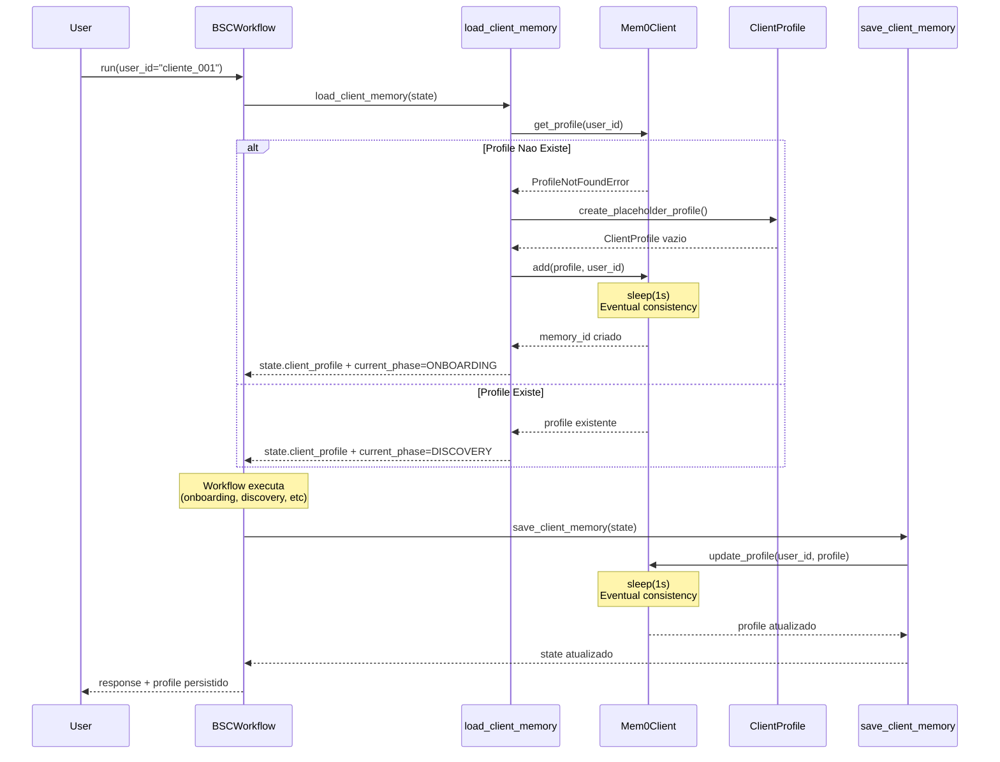
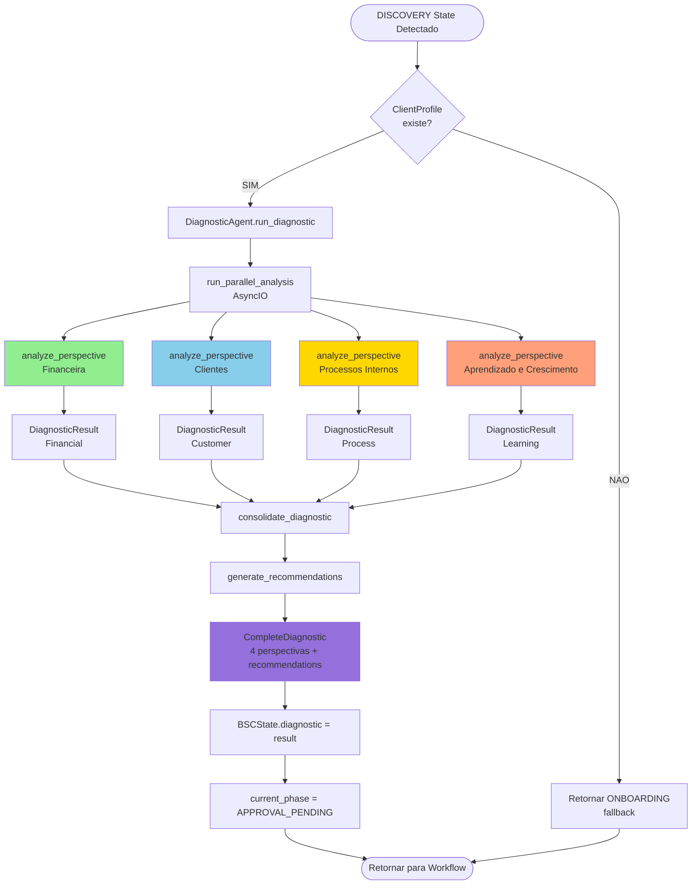
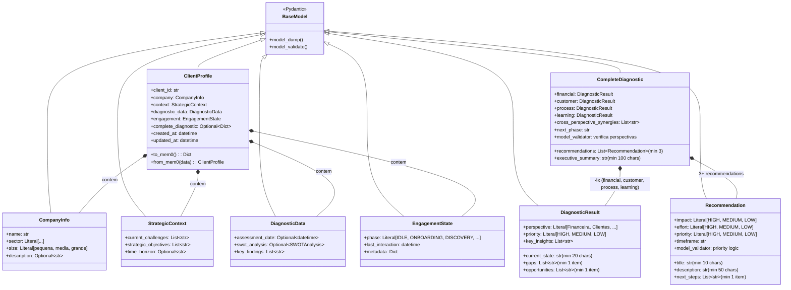
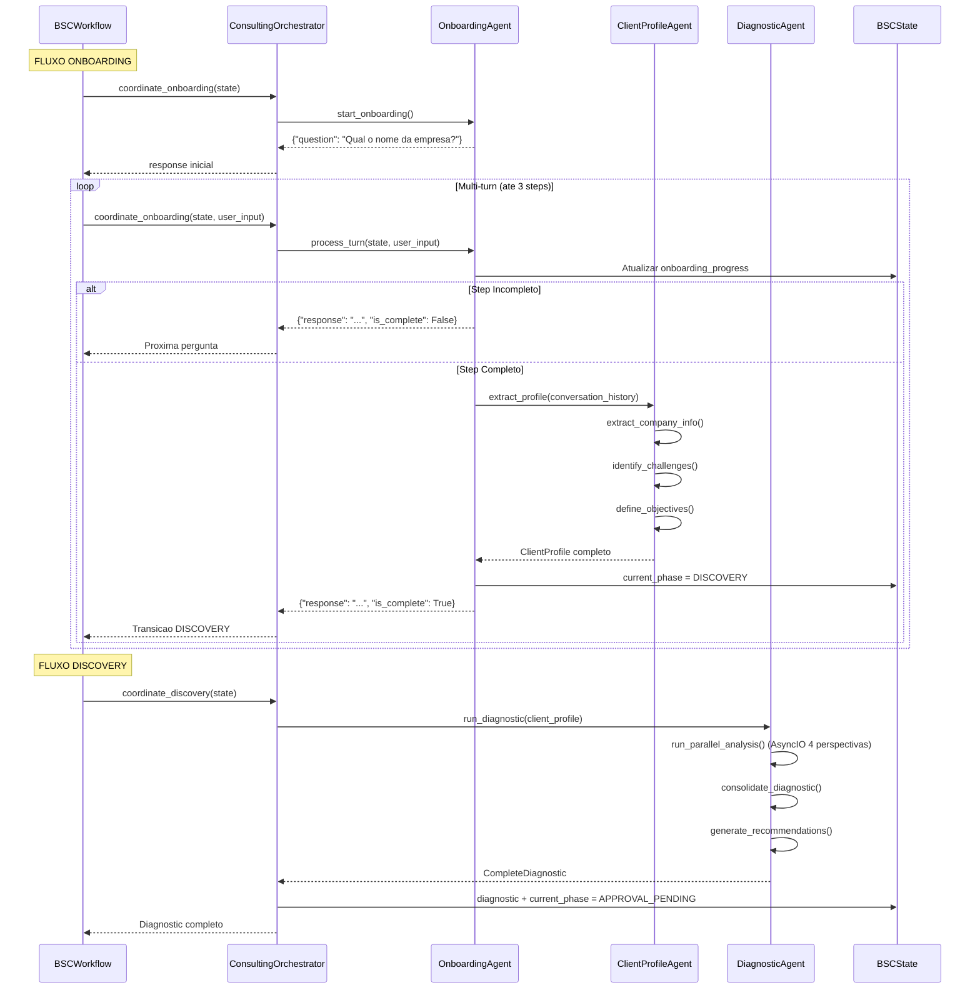
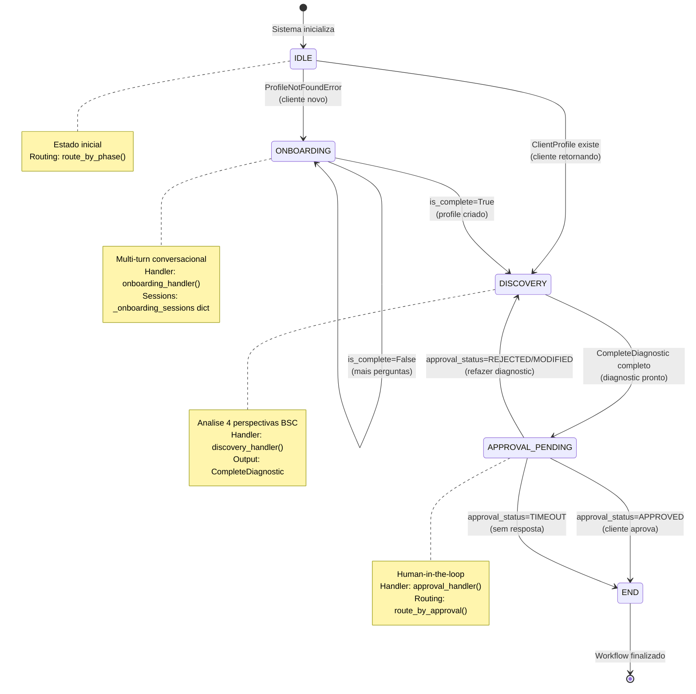

# Data Flow Diagrams - Agente Consultor BSC

**Data**: 2025-10-19  
**Versao**: 1.0  
**Objetivo**: Visualizar fluxos de dados criticos entre agentes, schemas e workflow para acelerar desenvolvimento FASE 3

---

## EXECUTIVE SUMMARY

Este documento apresenta **5 diagramas Mermaid** que mapeiam os fluxos de dados do sistema consultor BSC:

1. **ClientProfile Lifecycle**: Criacao → Persistencia Mem0 → Recuperacao
2. **Diagnostic Workflow**: DISCOVERY state → DiagnosticAgent → CompleteDiagnostic
3. **Schema Dependencies**: Relacoes Pydantic entre ClientProfile, BSCState, DiagnosticResult
4. **Agent Interactions**: Comunicacao entre OnboardingAgent, ClientProfileAgent, DiagnosticAgent
5. **State Transitions**: Estados LangGraph (ONBOARDING → DISCOVERY → APPROVAL_PENDING)

**ROI Esperado**: Reducao de 15-20 min para 2-3 min por consulta de fluxo (economia 4.5h em 12 tarefas FASE 3)

---

## DIAGRAMA 1: ClientProfile Lifecycle

**Objetivo**: Mostrar como ClientProfile e criado, persistido no Mem0 e recuperado em sessoes futuras.

**Pontos Criticos**:
- Eventual consistency: sleep(1s) apos add() e update()
- ProfileNotFoundError trigger para criar novo profile
- Delete-then-add pattern garante 1 memoria por user_id

**Arquivos Relacionados**:
- `src/graph/memory_nodes.py`: load_client_memory(), save_client_memory()
- `src/memory/mem0_client.py`: Mem0Client.get_profile(), add(), update_profile()
- `src/memory/schemas.py`: ClientProfile schema Pydantic

---

## DIAGRAMA 2: Diagnostic Workflow

**Objetivo**: Mapear fluxo DISCOVERY state desde deteccao ate geracao de CompleteDiagnostic.

**Pontos Criticos**:
- Analise paralela AsyncIO das 4 perspectivas BSC
- Fallback para ONBOARDING se ClientProfile ausente
- Transicao automatica DISCOVERY → APPROVAL_PENDING

**Arquivos Relacionados**:
- `src/graph/workflow.py`: discovery_handler()
- `src/agents/diagnostic_agent.py`: run_diagnostic(), run_parallel_analysis()
- `src/prompts/diagnostic_prompts.py`: Prompts das 4 perspectivas
- `src/memory/schemas.py`: DiagnosticResult, Recommendation, CompleteDiagnostic

---

## DIAGRAMA 3: Schema Dependencies

**Objetivo**: Visualizar relacoes de composicao e heranca entre schemas Pydantic core.

**Pontos Criticos**:
- ClientProfile e schema raiz que agrega todos sub-schemas
- CompleteDiagnostic tem 4 campos individuais (financial, customer, process, learning)
- Recommendation tem priority logic no model_validator (HIGH impact + LOW effort = HIGH priority auto)

**Arquivos Relacionados**:
- `src/memory/schemas.py`: Todos schemas Pydantic
- `tests/test_memory_schemas.py`: Validacoes Pydantic (25 testes)
- `tests/test_diagnostic_agent.py`: Testes de DiagnosticResult/CompleteDiagnostic

---

## DIAGRAMA 4: Agent Interactions

**Objetivo**: Mostrar comunicacao entre agentes durante workflows ONBOARDING e DISCOVERY.

**Pontos Criticos**:
- Multi-turn loop em ONBOARDING (ate 3 steps: COMPANY → STRATEGIC → ENGAGEMENT)
- Lazy loading de agentes em ConsultingOrchestrator (previne circular imports)
- ClientProfile criado automaticamente ao completar onboarding

**Arquivos Relacionados**:
- `src/graph/workflow.py`: onboarding_handler(), discovery_handler()
- `src/graph/consulting_orchestrator.py`: coordinate_onboarding(), coordinate_discovery()
- `src/agents/onboarding_agent.py`: start_onboarding(), process_turn()
- `src/agents/client_profile_agent.py`: extract_profile(), process_onboarding()
- `src/agents/diagnostic_agent.py`: run_diagnostic()

---

## DIAGRAMA 5: State Transitions

**Objetivo**: Mapear estados LangGraph e transicoes condicionais do workflow consultivo.

**Pontos Criticos**:
- IDLE e estado inicial (cliente sem interacao)
- ProfileNotFoundError trigger automatico para ONBOARDING
- APPROVAL_PENDING pode retornar para DISCOVERY se rejeitado

**Arquivos Relacionados**:
- `src/graph/consulting_states.py`: Enum ConsultingPhase, ApprovalStatus, TransitionTrigger
- `src/graph/workflow.py`: route_by_phase(), route_by_approval()
- `src/graph/consulting_orchestrator.py`: validate_transition()
- `docs/consulting/workflow-design.md`: Transition rules completas (1000+ linhas)

---

## NOTAS TECNICAS

### Mermaid Syntax Validada

Todos diagramas usam **Mermaid.js v11.1.0+** syntax:
- `sequenceDiagram`: Temporal flows com participantes e messages
- `flowchart TD`: Top-to-bottom decision flows
- `classDiagram`: UML class relationships (composicao `*--`, heranca `<|--`)
- `stateDiagram-v2`: Finite state machines com transitions

### Best Practices Aplicadas (2024-2025)

1. **LangGraph StateGraph Pattern** (LangChain Sep 2025):
   - Nodes como Python functions
   - Conditional edges com routing functions
   - State como TypedDict/Pydantic
   
2. **AsyncIO Parallelism** (validado FASE 2):
   - run_parallel_analysis() executa 4 perspectivas simultaneamente
   - 3.34x speedup vs serial (70s → 21s P50)
   
3. **Eventual Consistency Mem0** (validado FASE 1.8):
   - sleep(1s) apos add() e update()
   - Delete-then-add pattern previne duplicatas
   - 100% success rate em testes E2E

4. **Pydantic V2 Validators** (Sep 2024):
   - field_validator: Validacao individual (listas nao vazias, min_length)
   - model_validator(mode='after'): Cross-field validation (priority logic)
   
5. **TYPE_CHECKING Pattern** (PEP 484 + PEP 563):
   - `from __future__ import annotations` (postponed annotations)
   - `if TYPE_CHECKING:` imports para type hints (zero circular imports runtime)

### Ferramentas de Validacao

Para verificar diagramas Mermaid:
- **Mermaid Live Editor**: https://mermaid.live/
- **VS Code Extension**: Mermaid Preview (bierner.markdown-mermaid)
- **Markdown Preview Enhanced**: Suporta Mermaid nativamente

---

## REFERENCIAS

1. **LangGraph Architecture** (Medium, Sep 2024): https://medium.com/@shuv.sdr/langgraph-architecture-and-design-280c365aaf2c
2. **AI Agent Architectures 2025** (DEV Community, May 2025): https://dev.to/sohail-akbar/the-ultimate-guide-to-ai-agent-architectures-in-2025-2j1c
3. **Mermaid Architecture Diagrams** (Official Docs, v11.1.0+): https://mermaid.js.org/syntax/architecture.html
4. **LangGraph Multi-Agent Workflows** (LangChain Blog, Sep 2025): https://blog.langchain.com/building-langgraph/
5. **Lesson Regression Prevention** (Interno, Out 2025): `docs/lessons/lesson-regression-prevention-methodology-2025-10-17.md`

---

**Ultima Atualizacao**: 2025-10-19 (Sessao 15, FASE 3 - Tarefa 3.0.1)  
**Autores**: Agente BSC RAG + Sequential Thinking + Brightdata Research  
**Proximo**: Tarefa 3.0.2 - API Contracts Documentation

