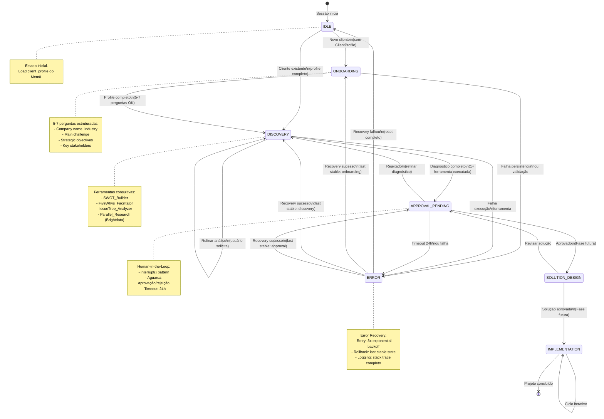

# [OBSOLETO - 2025-10-20] Workflow Design Sequencial

**ARQUIVADO EM:** 2025-10-20  
**RAZÃO:** Este documento reflete o design original do onboarding sequencial (formulário fixo).  
**SUBSTITUÍDO POR:** `docs/consulting/onboarding-conversational-design.md`  
**REFATORAÇÃO:** Implementação de onboarding conversacional inteligente com 3 fases:
- FASE 1: Opportunistic Extraction
- FASE 2: Intelligent Validation  
- FASE 3: Periodic Confirmation

Arquivado para referência histórica. Não usar este design para novas implementações.

---

# 🎯 BSC Consulting Agent - Workflow Design v2.0

**Data**: 2025-10-15  
**Versão**: 2.0 (MVP - Fase 2)  
**Status**: Design Aprovado  
**Implementação**: FASE 2.1 Completa

---

## 📋 EXECUTIVE SUMMARY

### Objetivo

Transformar **Agente BSC RAG** (Q&A sobre literatura BSC) em **Agente Consultor Empresarial BSC** através de workflow multi-fase com human-in-the-loop.

### Decisões de Arquitetura

- **Framework**: LangGraph StateGraph (state machine pattern)
- **Persistence**: Mem0 Platform (self-improving memory)
- **Human-in-the-Loop**: interrupt() pattern (LangGraph oficial)
- **Error Recovery**: Retry (3x) + Rollback to last stable state
- **Estados MVP**: 4 (IDLE, ONBOARDING, DISCOVERY, APPROVAL_PENDING)

### Referências Best Practices (2024-2025)

- **DEV**: "LangGraph State Machines: Managing Complex Agent Task Flows" (Nov 2024)
- **Medium**: "Human-in-the-Loop in LangGraph with interrupt()" (2024)
- **LangChain**: Official docs - concepts/human_in_the_loop
- **Anthropic**: "Building Effective Agents" (workflows, orchestrator-workers)
- **OpenAI**: "Practical Guide to Building Agents" (evaluation-driven, planning)

---

## 🗺️ STATE MACHINE DIAGRAM

### Diagrama Visual (Mermaid)



### Legenda de Cores (Implementação)

- **Verde**: Estados MVP implementados (Fase 2)
- **Amarelo**: Estados futuros planejados (Fase 6-9)
- **Vermelho**: Estado de erro (recovery automático)

---

## 📊 ESTADOS DETALHADOS

### 1. IDLE (Estado Inicial)

**Objetivo**: Aguardar primeira interação e carregar contexto do cliente.

**Responsabilidades**:
- Carregar `client_profile` do Mem0 via `load_client_memory` node
- Detectar se cliente é novo (profile inexistente) ou existente
- Rotear para ONBOARDING ou DISCOVERY

**Dados de Entrada**:
```python
{
    "user_id": "empresa_123",
    "user_query": "Como implementar BSC na minha empresa?",
    "client_profile": None  # Será carregado
}
```

**Transições Possíveis**:
| Para | Condição | Trigger |
|------|----------|---------|
| ONBOARDING | `client_profile is None` | `NEW_CLIENT` |
| DISCOVERY | `client_profile is not None` | `RETURNING_CLIENT` |

**Tempo Médio**: <500ms (carga Mem0)

**Agente Responsável**: N/A (node automático)

---

### 2. ONBOARDING (Coleta de Contexto)

**Objetivo**: Criar `ClientProfile` completo através de 5-7 perguntas estruturadas.

**Responsabilidades**:
- Guiar usuário por perguntas obrigatórias
- Validar respostas (campos não vazios, formato adequado)
- Construir ClientProfile progressivamente
- Persistir profile no Mem0

**Perguntas Estruturadas**:

1. **Company Info**:
   - Nome da empresa? (str, required)
   - Indústria/setor? (str, required)
   - Tamanho (funcionários)? (int, optional)
   - Estágio de maturidade? (startup, growth, mature) (str, optional)

2. **Strategic Context**:
   - Principal desafio estratégico? (str, required)
   - Objetivos estratégicos (top 3)? (List[str], required)
   - Stakeholders-chave (C-level)? (List[str], optional)

**Dados de Estado**:
```python
{
    "onboarding_progress": {
        "company_name": True,
        "industry": True,
        "main_challenge": True,
        "objectives": False,  # Ainda não respondido
        "stakeholders": False
    },
    "client_profile": {
        "company": {
            "name": "TechCorp Ltda",
            "industry": "SaaS B2B",
            "size": 150
        },
        "strategic_context": {
            "main_challenge": "Escalar sem perder qualidade",
            "objectives": []  # Em progresso
        }
    }
}
```

**Transições Possíveis**:
| Para | Condição | Trigger | Tempo |
|------|----------|---------|-------|
| DISCOVERY | 5/5 perguntas obrigatórias OK | `PROFILE_COMPLETED` | 5-10 min |
| ONBOARDING | Perguntas incompletas | `PROFILE_INCOMPLETE` | N/A |
| ERROR | Falha Mem0 ou validação | `API_ERROR` | Immediate |

**Validações**:
- `company.name`: Non-empty, max 100 chars
- `industry`: Non-empty, max 50 chars
- `main_challenge`: Non-empty, max 500 chars
- `objectives`: List[str], min 1 item, max 5 items

**Agente Responsável**: `OnboardingAgent` (FASE 2.4)

---

### 3. DISCOVERY (Diagnóstico Estruturado)

**Objetivo**: Executar análises consultivas estruturadas usando ferramentas especializadas.

**Responsabilidades**:
- Sugerir ferramenta adequada baseado em `client_profile`
- Facilitar execução de ferramentas consultivas
- Validar qualidade dos outputs (completude, actionability)
- Enriquecer diagnóstico com benchmarks externos (Brightdata)

**Ferramentas Disponíveis** (FASE 3):

1. **SWOT_Builder**: Análise dos 4 quadrantes
   - Input: `company_info`, `strategic_context`
   - Output: `{strengths: [], weaknesses: [], opportunities: [], threats: []}`
   - Duração: 3-5 min
   - Qualidade: ValidatorAgent verifica completude (4+ itens/quadrante)

2. **FiveWhys_Facilitator**: Root cause analysis
   - Input: `main_challenge`
   - Output: `{root_cause: str, why_chain: [str]}`
   - Duração: 5-7 min
   - Qualidade: ValidatorAgent verifica profundidade (5 níveis)

3. **IssueTree_Analyzer**: Decomposição de problemas
   - Input: `main_challenge`
   - Output: `{problem: str, sub_problems: [{level: int, description: str}]}`
   - Duração: 4-6 min
   - Qualidade: 3+ níveis de profundidade

4. **Parallel_Research**: Benchmarks externos via Brightdata
   - Input: `industry`, `objectives`
   - Output: `{benchmarks: [], case_studies: [], kpis_setor: []}`
   - Duração: 2-4 min
   - Qualidade: 5+ resultados relevantes

**Dados de Estado**:
```python
{
    "tool_outputs": {
        "swot_analysis": {
            "strengths": [
                "Equipe técnica altamente qualificada",
                "Produto inovador com tração inicial",
                "Cultura de experimentação forte"
            ],
            "weaknesses": [
                "Processos operacionais ainda imaturos",
                "Falta de métricas financeiras consolidadas"
            ],
            "opportunities": [
                "Mercado SaaS B2B crescendo 30% a.a.",
                "Clientes enterprise buscando soluções"
            ],
            "threats": [
                "Competidores grandes entrando no mercado",
                "Dependência de poucos clientes iniciais"
            ]
        }
    },
    "diagnostic_quality_score": 0.85  # ValidatorAgent
}
```

**Transições Possíveis**:
| Para | Condição | Trigger | Tempo |
|------|----------|---------|-------|
| APPROVAL_PENDING | 1+ ferramenta executada, quality_score >= 0.70 | `DIAGNOSTIC_COMPLETED` | 10-20 min |
| DISCOVERY | Usuário solicita outra análise | `REFINEMENT_REQUESTED` | N/A |
| ERROR | Ferramenta falhou 3x | `API_ERROR` | Immediate |

**Lógica de Seleção de Ferramenta** (DiagnosticAgent):

```python
def suggest_tool(client_profile: ClientProfile) -> str:
    """Sugere ferramenta consultiva mais adequada."""
    challenge = client_profile.strategic_context.main_challenge.lower()
    
    # Heurísticas baseadas em palavras-chave
    if "problema" in challenge or "issue" in challenge:
        return "IssueTree_Analyzer"  # Decomposição
    
    if "causa" in challenge or "root cause" in challenge:
        return "FiveWhys_Facilitator"  # Root cause
    
    # Default: SWOT (mais abrangente)
    return "SWOT_Builder"
```

**Agente Responsável**: `DiagnosticAgent` (FASE 2.5) + `FacilitatorAgent` (FASE 3.1)

---

### 4. APPROVAL_PENDING (Human-in-the-Loop)

**Objetivo**: Aguardar aprovação/rejeição humana do diagnóstico usando LangGraph interrupt().

**Responsabilidades**:
- Pausar execução do graph (interrupt pattern)
- Apresentar diagnóstico formatado ao usuário
- Coletar feedback (approve/reject/modify)
- Persistir decisão no Mem0

**Padrão interrupt() (LangGraph)**:

```python
from langgraph.types import interrupt

async def approval_node(state: ConsultingState):
    """Node de aprovação com interrupt."""
    # Formatar diagnóstico para apresentação
    diagnostic_report = format_diagnostic(state["tool_outputs"])
    
    # interrupt() pausa graph e retorna controle ao usuário
    user_decision = interrupt({
        "type": "approval_request",
        "report": diagnostic_report,
        "options": ["approve", "reject", "modify"]
    })
    
    # Quando usuário responde, graph resume aqui
    state["approval_status"] = ApprovalStatus(user_decision["action"])
    state["approval_feedback"] = user_decision.get("feedback", "")
    
    return state
```

**Opções do Usuário**:

1. **APPROVE**: Diagnóstico satisfatório
   - Próximo estado: SOLUTION_DESIGN (Fase futura)
   - Timeout: N/A (aprovado explicitamente)

2. **REJECT**: Diagnóstico inadequado, precisa refinamento
   - Próximo estado: DISCOVERY
   - Feedback obrigatório: "O que melhorar?"
   - DiagnosticAgent re-executa com feedback

3. **MODIFY**: Usuário edita diagnóstico diretamente
   - Edições persistidas em `tool_outputs`
   - Próximo estado: APPROVAL_PENDING (re-confirmar)

4. **TIMEOUT**: 24h sem resposta
   - Próximo estado: ERROR
   - Notificação ao usuário (email/notificação)

**Dados de Estado**:
```python
{
    "approval_status": "pending",  # ou "approved", "rejected", "modified"
    "approval_feedback": "SWOT precisa mais Opportunities relacionadas ao mercado enterprise",
    "approval_timestamp": "2025-10-15T14:30:00Z",
    "timeout_at": "2025-10-16T14:30:00Z"  # 24h
}
```

**Transições Possíveis**:
| Para | Condição | Trigger | Tempo |
|------|----------|---------|-------|
| SOLUTION_DESIGN | `approval_status == APPROVED` | `USER_APPROVED` | Immediate |
| DISCOVERY | `approval_status == REJECTED` | `USER_REJECTED` | Immediate |
| APPROVAL_PENDING | `approval_status == MODIFIED` | `USER_MODIFIED` | Re-confirm |
| ERROR | 24h sem resposta | `APPROVAL_TIMEOUT` | 24h |

**Agente Responsável**: `ReportGeneratorAgent` (FASE 4.1) + `FeedbackCollector` (FASE 4.5)

---

### 5. SOLUTION_DESIGN (Futuro - Pós-MVP)

**Objetivo**: Projetar mapa estratégico BSC completo com objetivos nas 4 perspectivas.

**Responsabilidades** (Fase 6-7):
- Criar strategy map completo (objetivos + causa-efeito)
- Definir KPIs SMART para cada objetivo
- Validar alinhamento entre perspectivas (Financial → Customer → Process → Learning)

**Ferramentas**:
- `Strategy_Map_Designer`: Objetivos nas 4 perspectivas
- `KPI_Definer`: Métricas SMART
- `Alignment_Validator`: Verifica causa-efeito

**Transição**: `SOLUTION_DESIGN → IMPLEMENTATION` (quando aprovado)

---

### 6. IMPLEMENTATION (Futuro - Pós-MVP)

**Objetivo**: Planos de ação e acompanhamento (Execution Premium).

**Responsabilidades** (Fase 8-9):
- Criar action plans com milestones
- Integrar Asana (tasks) e Google Calendar (meetings) via MCPs
- Monitoring dashboard com progresso

**Transição**: `IMPLEMENTATION → IDLE` (projeto concluído)

---

### 7. ERROR (Recovery Automático)

**Objetivo**: Recuperar de falhas através de retry + rollback.

**Estratégia de Recovery**:

1. **Retry (3 tentativas)**:
   - Exponential backoff: 2s, 4s, 8s
   - Aplicável a: API errors (LLM, Mem0, Brightdata)
   - Logging completo de cada tentativa

2. **Rollback to Last Stable State**:
   - Se retry falhar, retornar a `last_stable_phase`
   - Restaurar estado do Mem0 (snapshot anterior)
   - Notificar usuário do rollback

3. **Reset Completo**:
   - Se rollback falhar, retornar a IDLE
   - Limpar estado corrupto
   - Iniciar sessão nova

**Severidades de Erro**:

| Severidade | Ação | Exemplo |
|------------|------|---------|
| LOW | Retry 3x | Timeout de API (transiente) |
| MEDIUM | Rollback | Ferramenta falhou (ex: SWOT parsing error) |
| HIGH | Reset + Notificação | Mem0 indisponível |
| CRITICAL | Reset + Alerta Dev | Corrupção de estado (bug) |

**Dados de Estado**:
```python
{
    "error_info": {
        "severity": "MEDIUM",
        "message": "SWOT_Builder failed: OpenAI rate limit exceeded",
        "timestamp": "2025-10-15T14:35:00Z",
        "retry_count": 2,
        "last_stable_phase": "DISCOVERY",
        "stack_trace": "..." # Apenas em dev
    }
}
```

**Transições Possíveis**:
| Para | Condição | Trigger |
|------|----------|---------|
| [LAST_STABLE] | Recovery sucesso | `RECOVERY_SUCCESS` |
| IDLE | Recovery falhou | `RECOVERY_FAILED` |

**Agente Responsável**: `ErrorHandler` (FASE 2, built-in)

---

## 🔄 TRANSITION RULES (Regras de Transição)

### Tabela Completa de Transições

| De | Para | Condição | Validação | Trigger | Tempo |
|----|------|----------|-----------|---------|-------|
| **IDLE** | ONBOARDING | `client_profile is None` | N/A | `NEW_CLIENT` | <500ms |
| **IDLE** | DISCOVERY | `client_profile is not None` | Profile válido | `RETURNING_CLIENT` | <500ms |
| **ONBOARDING** | DISCOVERY | 5/5 perguntas OK | Campos obrigatórios não vazios | `PROFILE_COMPLETED` | 5-10 min |
| **ONBOARDING** | ERROR | Falha Mem0 ou validação | N/A | `API_ERROR` / `VALIDATION_ERROR` | Immediate |
| **DISCOVERY** | APPROVAL_PENDING | 1+ ferramenta executada, quality >= 0.70 | `tool_outputs` não vazio | `DIAGNOSTIC_COMPLETED` | 10-20 min |
| **DISCOVERY** | DISCOVERY | Usuário solicita refinamento | N/A | `REFINEMENT_REQUESTED` | N/A |
| **DISCOVERY** | ERROR | Ferramenta falhou 3x | Retry esgotado | `API_ERROR` | 30s |
| **APPROVAL_PENDING** | SOLUTION_DESIGN | `approval_status == APPROVED` | N/A | `USER_APPROVED` | Immediate |
| **APPROVAL_PENDING** | DISCOVERY | `approval_status == REJECTED` | `approval_feedback` não vazio | `USER_REJECTED` | Immediate |
| **APPROVAL_PENDING** | ERROR | Timeout 24h | N/A | `APPROVAL_TIMEOUT` | 24h |
| **ERROR** | [LAST_STABLE] | Recovery sucesso | Estado recuperado válido | `RECOVERY_SUCCESS` | 10-30s |
| **ERROR** | IDLE | Recovery falhou | N/A | `RECOVERY_FAILED` | 10-30s |

### Validações por Transição

#### ONBOARDING → DISCOVERY

```python
def validate_profile_complete(state: ConsultingState) -> bool:
    """Valida se profile está completo para transição."""
    profile = state.get("client_profile")
    if not profile:
        return False
    
    # Campos obrigatórios: company, industry, main_challenge, objectives
    company = profile.get("company", {})
    context = profile.get("strategic_context", {})
    
    required_fields = [
        company.get("name"),
        company.get("industry"),
        context.get("main_challenge"),
        context.get("objectives")
    ]
    
    # Todos campos não vazios
    return all(
        field is not None and len(str(field).strip()) > 0
        for field in required_fields
    )
```

#### DISCOVERY → APPROVAL_PENDING

```python
def validate_diagnostic_complete(state: ConsultingState) -> bool:
    """Valida se diagnóstico está completo."""
    tool_outputs = state.get("tool_outputs", {})
    
    # Pelo menos 1 ferramenta executada
    if len(tool_outputs) == 0:
        return False
    
    # Quality score >= 0.70 (validado por ValidatorAgent)
    quality_score = state.get("diagnostic_quality_score", 0.0)
    if quality_score < 0.70:
        return False
    
    return True
```

---

## 🛠️ IMPLEMENTAÇÃO LANGGRAPH

### Estrutura do StateGraph

```python
from langgraph.graph import StateGraph
from src.graph.consulting_states import ConsultingState, ConsultingPhase

# Criar StateGraph
workflow = StateGraph(ConsultingState)

# ===== Adicionar Nodes =====

# Memory nodes (FASE 1 - já implementados)
workflow.add_node("load_client_memory", load_client_memory)
workflow.add_node("save_client_memory", save_client_memory)

# Consulting nodes (FASE 2)
workflow.add_node("onboarding", onboarding_node)
workflow.add_node("discovery", discovery_node)
workflow.add_node("approval", approval_node)
workflow.add_node("error_handler", error_handler_node)

# ===== Adicionar Edges (Transições) =====

# Entry point: Load memory first
workflow.set_entry_point("load_client_memory")

# IDLE routing (conditional)
workflow.add_conditional_edges(
    "load_client_memory",
    route_from_idle,  # Função de roteamento
    {
        "onboarding": "onboarding",  # Novo cliente
        "discovery": "discovery"     # Cliente existente
    }
)

# ONBOARDING transitions
workflow.add_conditional_edges(
    "onboarding",
    route_from_onboarding,
    {
        "discovery": "discovery",
        "error": "error_handler"
    }
)

# DISCOVERY transitions
workflow.add_conditional_edges(
    "discovery",
    route_from_discovery,
    {
        "approval": "approval",
        "discovery": "discovery",  # Refinamento
        "error": "error_handler"
    }
)

# APPROVAL transitions
workflow.add_conditional_edges(
    "approval",
    route_from_approval,
    {
        "discovery": "discovery",     # Rejected
        "save_memory": "save_client_memory"  # Approved (save e fim)
    }
)

# ERROR recovery
workflow.add_conditional_edges(
    "error_handler",
    route_from_error,
    {
        "onboarding": "onboarding",
        "discovery": "discovery",
        "approval": "approval",
        "load_memory": "load_client_memory"  # Reset completo
    }
)

# Final edge
workflow.add_edge("save_client_memory", END)

# Compilar
app = workflow.compile()
```

### Funções de Roteamento

```python
def route_from_idle(state: ConsultingState) -> str:
    """Rota de IDLE para ONBOARDING ou DISCOVERY."""
    if state.get("client_profile") is None:
        return "onboarding"
    return "discovery"

def route_from_onboarding(state: ConsultingState) -> str:
    """Rota de ONBOARDING para DISCOVERY ou ERROR."""
    if validate_profile_complete(state):
        return "discovery"
    if state.get("error_info"):
        return "error"
    return "onboarding"  # Continua coletando

def route_from_discovery(state: ConsultingState) -> str:
    """Rota de DISCOVERY para APPROVAL, DISCOVERY (refinamento), ou ERROR."""
    if validate_diagnostic_complete(state):
        return "approval"
    if state.get("error_info"):
        return "error"
    return "discovery"  # Refinamento

def route_from_approval(state: ConsultingState) -> str:
    """Rota de APPROVAL para DISCOVERY (rejected) ou save (approved)."""
    approval_status = state.get("approval_status")
    
    if approval_status == ApprovalStatus.REJECTED:
        return "discovery"
    elif approval_status == ApprovalStatus.APPROVED:
        return "save_memory"
    else:
        # PENDING ou TIMEOUT → ERROR
        return "error"

def route_from_error(state: ConsultingState) -> str:
    """Rota de ERROR para last stable state ou reset."""
    error_info = state.get("error_info")
    if not error_info:
        return "load_memory"  # Reset
    
    last_stable = error_info.get("last_stable_phase")
    
    if last_stable == ConsultingPhase.ONBOARDING:
        return "onboarding"
    elif last_stable == ConsultingPhase.DISCOVERY:
        return "discovery"
    elif last_stable == ConsultingPhase.APPROVAL_PENDING:
        return "approval"
    else:
        return "load_memory"  # Reset completo
```

---

## 📊 MÉTRICAS DE SUCESSO

### Métricas Técnicas (Objetivas)

| Métrica | Target MVP | Como Medir |
|---------|------------|------------|
| **Onboarding Completion Rate** | >= 80% | % usuários que completam 5-7 perguntas |
| **Time-to-First-Insight** | < 30 min | Tempo de IDLE → APPROVAL_PENDING |
| **Diagnostic Quality Score** | >= 0.75 | ValidatorAgent score médio |
| **Approval Rate** | >= 60% | % diagnósticos aprovados na 1ª tentativa |
| **Error Recovery Success** | >= 90% | % errors recuperados sem reset completo |
| **Memory Load Latency** | < 500ms | Tempo load_client_memory node |

### Métricas Qualitativas (Usuário Avalia)

| Métrica | Target MVP | Como Medir |
|---------|------------|------------|
| **Onboarding Experience** | >= 4/5 | Rating pós-onboarding |
| **Diagnostic Relevance** | >= 4/5 | "Diagnóstico útil e contextualizado?" |
| **Facilitation Quality** | >= 4/5 | "Ferramentas bem guiadas?" |
| **Professional Output** | >= 4/5 | "Report apresentável para board?" |
| **NPS (Net Promoter Score)** | >= 7/10 | "Recomendaria para outro C-level?" |

### Métricas de Adoção (Pós-MVP Beta)

| Métrica | Target 3 Meses | Como Medir |
|---------|----------------|------------|
| **Return Rate** | >= 60% | % clientes que retornam (sessão 2+) |
| **Tool Usage** | >= 2 ferramentas/sessão | Média de tool_outputs por sessão |
| **Completion Rate** | >= 70% | % sessões que chegam a APPROVAL_PENDING |
| **Refinement Rate** | < 30% | % sessões que voltam de APPROVAL → DISCOVERY |

---

## 🎯 CASOS DE USO PRÁTICOS

### Caso 1: Startup SaaS (Novo Cliente)

**Contexto**: Startup de 50 funcionários, crescendo 3x a.a., quer estruturar estratégia.

**Fluxo**:
1. **IDLE → ONBOARDING** (5 min)
   - Perguntas: Nome, indústria, desafio ("Escalar sem perder qualidade"), objetivos
   
2. **ONBOARDING → DISCOVERY** (15 min)
   - Ferramenta sugerida: SWOT_Builder
   - Output: 12 pontos (3 Strengths, 4 Weaknesses, 3 Opportunities, 2 Threats)
   - Quality score: 0.82
   
3. **DISCOVERY → APPROVAL_PENDING** (Immediate)
   - Report formatado apresentado
   - Usuário aprova com pequenos ajustes (MODIFY)
   
4. **APPROVAL_PENDING → save_memory** (Immediate)
   - Profile + diagnóstico salvos no Mem0
   - Próxima sessão: Cliente existente, pula onboarding

**Tempo Total**: ~20 min  
**Métricas**: Completion rate: 100%, Approval: 1ª tentativa, NPS: 9/10

---

### Caso 2: Empresa Madura (Cliente Existente)

**Contexto**: Manufatura 500 funcionários, já tem BSC implantado, quer refinar perspectiva Learning & Growth.

**Fluxo**:
1. **IDLE → DISCOVERY** (Immediate, profile existente)
   
2. **DISCOVERY** (20 min)
   - Ferramenta sugerida: IssueTree_Analyzer (foco em L&G)
   - Output: Problema decomposto em 3 níveis
   - Usuário solicita: "Adicionar benchmarks de L&G no setor"
   - Parallel_Research executado (Brightdata)
   - Diagnóstico enriquecido
   
3. **DISCOVERY → APPROVAL_PENDING** (Após refinamento)
   - Report com benchmarks apresentado
   - Usuário aprova
   
4. **APPROVAL_PENDING → save_memory** (Immediate)

**Tempo Total**: ~25 min (incluindo refinamento)  
**Métricas**: Refinement rate: 1x (esperado), Approval: 2ª tentativa, NPS: 8/10

---

### Caso 3: Error Recovery (Timeout Mem0)

**Contexto**: Cliente em DISCOVERY, Mem0 API timeout durante save.

**Fluxo**:
1. **DISCOVERY → ERROR** (Timeout detectado)
   - Error severity: MEDIUM
   - Retry 3x (2s, 4s, 8s)
   - Retry 2 sucesso!
   
2. **ERROR → DISCOVERY** (Recovery success)
   - Estado restaurado
   - Usuário notificado: "Conexão restaurada, continuando diagnóstico"
   
3. **DISCOVERY → APPROVAL_PENDING** (Continua normal)

**Tempo Total**: +14s latência (retry)  
**Métricas**: Error recovery success: 100%, User impact: Mínimo

---

## 🔮 ROADMAP DE EXPANSÃO

### Fase 2 (MVP) - 4-5 Semanas ✅ EM ANDAMENTO

- [x] FASE 2.1: Design Workflow States ✅
- [ ] FASE 2.2: Expand ConsultingState
- [ ] FASE 2.3: ClientProfileAgent
- [ ] FASE 2.4: OnboardingAgent
- [ ] FASE 2.5: DiagnosticAgent
- [ ] FASE 2.6-2.10: Nodes + Orchestrator + E2E Tests

**Entregável**: Workflow IDLE → ONBOARDING → DISCOVERY → APPROVAL funcional

---

### Fase 3 (Diagnostic Tools) - 5-6 Semanas

- [ ] 3.1: FacilitatorAgent
- [ ] 3.2: ValidatorAgent
- [ ] 3.3-3.6: 4 Ferramentas consultivas (SWOT, 5 Whys, Issue Tree, KPI Definer)
- [ ] 3.7-3.12: Evaluator-Optimizer Loop + Tool Selection Logic

**Entregável**: 4 ferramentas consultivas validadas

---

### Fase 4 (Deliverables) - 4-5 Semanas

- [ ] 4.1: ReportGeneratorAgent
- [ ] 4.2-4.3: Templates profissionais (Diagnostic Report, Strategy Map)
- [ ] 4.4-4.9: Approval Workflow + Feedback Collection + Refinement

**Entregável**: Reports profissionais + Human-in-the-Loop completo

---

### Fase 5 (Enhancement) - 3-4 Semanas

- [ ] 5.1-5.3: Brightdata Integration (Benchmark Retriever, Parallel Research)
- [ ] 5.4-5.7: Metrics Definition + Collector + Dashboard
- [ ] 5.9: Cloud Deployment Prep (Dockerfile, Fly.io)

**Entregável**: MVP cloud-ready com benchmarks externos

---

### Fase 6-9 (Pós-MVP) - 8-12 Semanas

- [ ] SOLUTION_DESIGN state + Strategy Map Designer
- [ ] IMPLEMENTATION state + Action Plans
- [ ] MCPs adicionais (Asana, Google Calendar)
- [ ] Multi-domain knowledge (OKRs, Design Thinking)

**Entregável**: Agente consultor completo end-to-end

---

## 📚 REFERÊNCIAS

### Papers e Artigos (2024-2025)

1. **LangGraph State Machines** (DEV Community, Nov 2024)
   - Link: https://dev.to/jamesli/langgraph-state-machines-managing-complex-agent-task-flows-in-production-36f4
   - Key insights: StateGraph pattern, error recovery, best practices

2. **Human-in-the-Loop in LangGraph** (Medium, 2024)
   - Link: https://medium.com/@areebaayub2908/human-in-the-loop-in-langgraph-with-interrupt-langgraph-a3a9774b847e
   - Key insights: interrupt() pattern, approval workflows

3. **LangGraph Part 4: Human-in-the-Loop** (Medium, 160+ likes, 2024)
   - Link: https://medium.com/@sitabjapal03/langgraph-part-4-human-in-the-loop-for-reliable-ai-workflows-aa4cc175bce4
   - Key insights: Reliability, review-approve-modify pattern

4. **LangChain Official Docs** (2024-2025)
   - Link: https://langchain-ai.github.io/langgraph/concepts/human_in_the_loop/
   - Key insights: Persistent execution state, interrupts API

5. **Anthropic: Building Effective Agents** (2024)
   - Link: https://www.anthropic.com/engineering/building-effective-agents
   - Key insights: Workflows, orchestrator-workers, evaluator-optimizer

6. **OpenAI: Practical Guide to Building Agents** (2024)
   - Link: https://cdn.openai.com/business-guides-and-resources/a-practical-guide-to-building-agents.pdf
   - Key insights: Evaluation-driven, planning/CoT, human handoff

### Framework Patterns Aplicados

- **12-Factor Agents**: Config in environment, stateless processes, human-in-the-loop
- **Anthropic Patterns**: Workflows, orchestrator-workers, evaluator-optimizer
- **OpenAI Best Practices**: Tool use, multi-agent, evaluation-driven

---

**Última Atualização**: 2025-10-15  
**Versão**: 2.0 (FASE 2.1 Design Completo)  
**Status**: ✅ Aprovado para Implementação  
**Próximo**: FASE 2.2 - Expand ConsultingState (implementação código)

