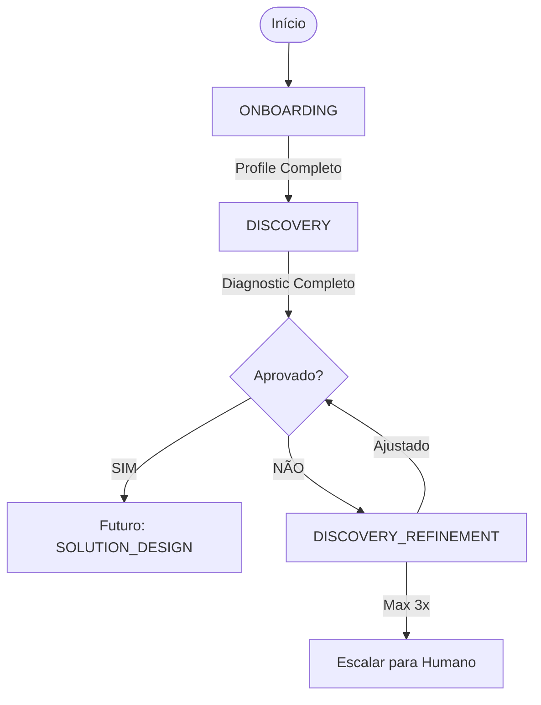

# Workflow Design: Agente Consultor BSC

**Data**: 2025-10-15  
**Status**: Design Aprovado, Implementação Pendente

---

## 🎯 Visão Geral

Workflow estruturado que guia C-level através de processo consultivo BSC em 3 fases principais (MVP):
1. **ONBOARDING**: Coleta contexto empresa (5-7 perguntas)
2. **DISCOVERY**: Diagnóstico estruturado (SWOT, 5 Whys, análise desafios)
3. **APPROVAL_PENDING**: Confirmação humana antes de prosseguir

Fases futuras (pós-MVP):
4. **SOLUTION_DESIGN**: Mapa estratégico + KPIs
5. **IMPLEMENTATION**: Action plans + milestones

---

## 🏗️ Estados do Workflow (MVP)

### State 1: ONBOARDING
**Objetivo**: Coletar contexto empresarial essencial  
**Duração Esperada**: 5-10 minutos  
**Agente**: OnboardingAgent

**Perguntas Estruturadas**:
1. Nome da empresa e setor de atuação?
2. Porte da empresa (funcionários, receita)?
3. Principal desafio estratégico atual?
4. Maturidade BSC (nunca ouviu, explorando, implementando, maduro)?
5. Objetivos estratégicos atuais (se existirem)?
6. Stakeholders-chave no processo estratégico?
7. Expectativa desta consultoria?

**Outputs**:
- ClientProfile completo salvo em Mem0
- Contexto suficiente para diagnóstico relevante

**Transition**: ONBOARDING → DISCOVERY (quando todas perguntas respondidas)

---

### State 2: DISCOVERY
**Objetivo**: Diagnóstico estruturado dos desafios estratégicos  
**Duração Esperada**: 20-30 minutos  
**Agentes**: DiagnosticAgent + FacilitatorAgent + ValidatorAgent

**Ferramentas Disponíveis**:
- **SWOT_Builder**: Análise SWOT estruturada (4 quadrantes)
- **FiveWhys_Facilitator**: Root cause analysis (problema → causa raiz)
- **IssueTree_Analyzer**: Decomposição de problema complexo
- **Benchmark_Retriever**: KPIs e práticas do setor (Brightdata)

**Processo**:
1. DiagnosticAgent analisa contexto + busca benchmarks setor
2. FacilitatorAgent sugere ferramenta adequada ao desafio
3. Cliente usa ferramentas guiado pelo agente
4. ValidatorAgent avalia completude/qualidade
5. DiagnosticAgent sintetiza insights em diagnostic report

**Outputs**:
- Diagnostic Report estruturado (markdown):
  - Executive Summary
  - Company Context
  - Strategic Challenges Identified
  - SWOT Analysis
  - Root Causes (5 Whys)
  - Industry Benchmarks
  - Recommendations
  - Next Steps

**Transition**: DISCOVERY → APPROVAL_PENDING (quando diagnostic completo)

---

### State 3: APPROVAL_PENDING
**Objetivo**: Confirmação humana crítica  
**Duração Esperada**: 5-10 minutos  
**Agente**: ConsultingOrchestrator

**Workflow**:
1. Apresentar diagnostic report para cliente
2. Solicitar feedback estruturado:
   - Aprovação: "SIM" / "NÃO" / "COM AJUSTES"
   - Rating: 1-5 (qualidade do diagnóstico)
   - Comentários: texto livre
3. Salvar feedback em Mem0

**Transitions**:
- Se **APROVADO**: DISCOVERY → (Futuro: SOLUTION_DESIGN)
- Se **REJEITADO**: APPROVAL_PENDING → DISCOVERY_REFINEMENT
  - DiagnosticAgent refina baseado em feedback
  - Máximo 3 iterações de refinamento
  - Reapresenta diagnostic ajustado

**Outputs**:
- Decisão registrada (approval/rejection)
- Feedback estruturado salvo
- Report final aprovado

---

## 🔄 Diagrama de Transições (MVP)

---

## 🤖 Agentes e Responsabilidades

| Agente | States | Responsabilidade |
|--------|--------|------------------|
| **OnboardingAgent** | ONBOARDING | Conduzir perguntas estruturadas |
| **ClientProfileAgent** | ONBOARDING | Extrair e salvar contexto em Mem0 |
| **DiagnosticAgent** | DISCOVERY | Analisar + gerar diagnostic report |
| **FacilitatorAgent** | DISCOVERY | Guiar uso de ferramentas |
| **ValidatorAgent** | DISCOVERY | Avaliar qualidade outputs |
| **ConsultingOrchestrator** | TODOS | Coordenar agentes + decidir transitions |

---

## 🎯 Métricas de Sucesso

| Métrica | Target MVP | Como Medir |
|---------|------------|------------|
| Onboarding Completion Rate | >= 80% | % clientes que completam 7 perguntas |
| Discovery Completion Rate | >= 70% | % clientes que chegam ao diagnostic report |
| Time-to-First-Insight | < 30 min | Onboarding + Discovery completos |
| Approval Rate (1st iteration) | >= 60% | % diagnostics aprovados sem refinamento |
| Diagnostic Quality Rating | >= 4/5 | Rating médio dado por clientes |

---

## 🚀 Roadmap Futuro

### FASE 8: SOLUTION_DESIGN State (Pós-MVP)
**Quando**: Após MVP validado + clientes pedirem "próximo passo"

**Ferramentas**:
- Strategy Map Designer avançado (relações causa-efeito visualizadas)
- KPI Dashboard Generator (Excel/Google Sheets)
- Alignment Matrix (objetivos × KPIs × responsáveis)

**Output**: Plano estratégico completo

---

### FASE 9: IMPLEMENTATION State (Pós-MVP)
**Quando**: Após SOLUTION_DESIGN implementado

**Ferramentas**:
- Action Plan Builder (tarefas, prazos, owners)
- Milestone Tracker (progresso implementation)
- Governance Manual Generator (cadência reviews, templates)

**Output**: Roadmap implementação executável

---

## 📋 Princípios de Design

### Anthropic Workflows Pattern
- ✅ Orquestração predefinida (não autonomia total)
- ✅ LLM em pontos específicos (análise, facilitação)
- ✅ Transitions governadas (não aleatórias)

### 12-Factor #9: Human-in-the-Loop
- ✅ Confirmation points críticos (após diagnostic)
- ✅ Feedback loop estruturado
- ✅ Refinement baseado em input humano

### OpenAI: Handoff to Humans
- ✅ Cliente no controle (aprova/rejeita)
- ✅ Agente augmenta, não substitui
- ✅ Transparência (explica recomendações)

---

**Próximo**: Implementar workflow em LangGraph (FASE 2)

