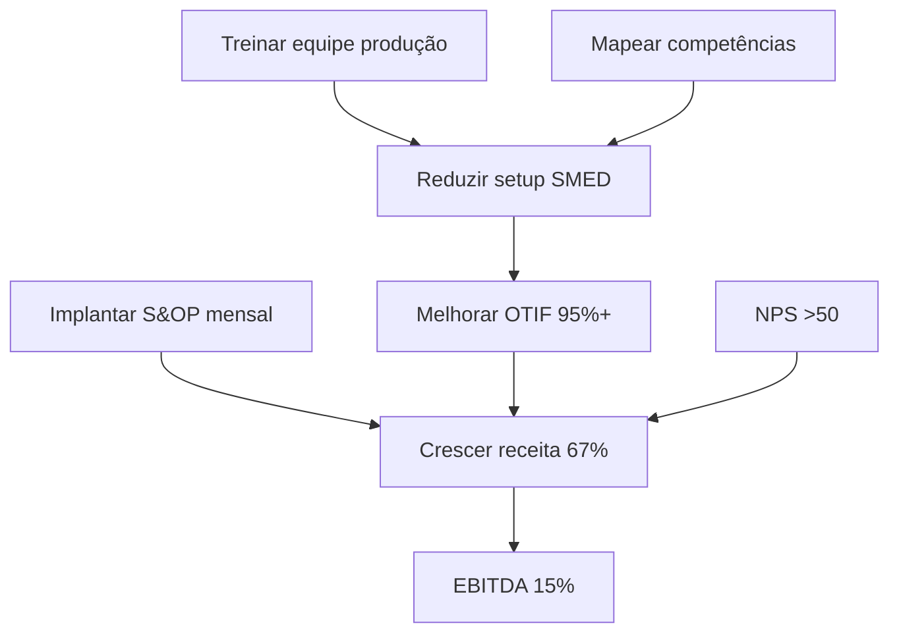

# [EMOJI] ROADMAP: SOLUTION_DESIGN + IMPLEMENTATION

**Versão**: 1.0  
**Data**: 2025-11-20  
**Autor**: Análise via Sequential Thinking (8 thoughts)  
**Status**: Planejamento aprovado - Aguardando decisão de implementação

---

## [EMOJI] EXECUTIVE SUMMARY

### Situação Atual

**FASES COMPLETAS (92% progresso geral - 46/50 tarefas):**
- [OK] **FASE 1**: Onboarding Agent conversacional inteligente
- [OK] **FASE 2A**: Query Decomposition, Adaptive Re-ranking, Router (3/3 técnicas)
- [OK] **FASE 3**: Ferramentas Consultivas (7/7 tools)
- [OK] **FASE 4**: Advanced Features (9/9 tarefas - Judge, Performance, APIs, Dashboard)
- [OK] **HOJE (Nov 20)**: RAG contextual implementado como workaround

**GAP CRÍTICO IDENTIFICADO:**
- Sistema completa diagnóstico -> transiciona para `APPROVAL_PENDING`
- Queries sobre implementação -> RAG genérico SEM contexto do diagnóstico
- Fases `SOLUTION_DESIGN` e `IMPLEMENTATION` planejadas mas NUNCA implementadas
- Existem apenas como placeholders em `consulting_states.py` (linhas 85-109)

### O Que Estava Previsto (workflow-design.md - OBSOLETO 2025-10-22)

**SOLUTION_DESIGN (Fase 6-7):**
- Criar Strategy Map completo (objetivos + causa-efeito entre 4 perspectivas BSC)
- Definir KPIs SMART alinhados aos objetivos
- Validar alinhamento cross-perspective
- **Esforço estimado original**: 3-4 semanas

**IMPLEMENTATION (Fase 8-9):**
- Gerar action plans com milestones (90/180/365 dias)
- Integrar Asana (tasks) e Google Calendar (meetings) via MCPs
- Monitoring dashboard com progresso
- **Esforço estimado original**: 4-5 semanas

**Por que não foi implementado?**
- Roadmap foi redirecionado para FASE 4 (Advanced Features)
- FASE 5 atual no roadmap é sobre Production/Deploy (Docker, CI/CD), NÃO workflow consultivo
- Fases SOLUTION_DESIGN + IMPLEMENTATION foram deprioritizadas

---

## [EMOJI] DUAS OPÇÕES DE IMPLEMENTAÇÃO

## OPÇÃO A - MVP Rápido (1-2 semanas) [EMOJI] RECOMENDADO

### Objetivo
Entregar **Strategy Map visual** como entregável CEO-ready com mínimo esforço.

### Escopo
**Fase 5A MVP - SOLUTION_DESIGN Essencial**

### Tarefas

#### Tarefa 1: Strategy_Map_Designer_Tool (6-8h de desenvolvimento)

**Descrição:**
Ferramenta que converte diagnóstico BSC em Strategy Map visual completo.

**Inputs:**
- `ClientProfile.context.strategic_objectives` (já coletado no onboarding)
- `CompleteDiagnostic` (output do DiagnosticAgent)
- Recomendações priorizadas (top 10 do diagnóstico)

**Outputs:**
- Strategy Map JSON estruturado (4 perspectivas + objetivos + KPIs)
- Diagrama Mermaid visual (renderizável no Streamlit)
- Conexões causa-efeito entre perspectivas (ex: Aprendizado -> Processos -> Clientes -> Financeira)

**Algoritmo:**
```python
def design_strategy_map(client_profile, diagnostic):
    """
    1. Extrair objetivos estratégicos do client_profile
    2. Agrupar por perspectiva BSC (Financial, Customer, Process, Learning)
    3. Conectar objetivos via causa-efeito (ex: "Treinar equipe" -> "Melhorar qualidade" -> "Aumentar NPS" -> "Crescer receita")
    4. Associar KPIs a cada objetivo (reutilizar kpi_tool.py)
    5. Gerar diagrama Mermaid visual
    """
```

**Reutilização de Código Existente:**
- 70% código reutilizável:
  - `strategic_objectives_tool.py` (definir objetivos SMART)
  - `kpi_tool.py` (definir KPIs)
  - `diagnostic_agent.py` (estrutura 4 perspectivas)
- 30% código novo:
  - Lógica de conexão causa-efeito
  - Geração diagrama Mermaid

**Schema Pydantic:**
```python
class StrategyMapObjective(BaseModel):
    id: str = Field(description="ID único do objetivo")
    perspective: Literal["Financeira", "Clientes", "Processos Internos", "Aprendizado e Crescimento"]
    title: str = Field(min_length=10, max_length=100)
    description: str = Field(min_length=50)
    kpis: list[str] = Field(min_length=1, description="KPIs associados")
    dependencies: list[str] = Field(default_factory=list, description="IDs de objetivos que habilitam este")

class StrategyMap(BaseModel):
    financial_objectives: list[StrategyMapObjective]
    customer_objectives: list[StrategyMapObjective]
    process_objectives: list[StrategyMapObjective]
    learning_objectives: list[StrategyMapObjective]
    mermaid_diagram: str = Field(description="Diagrama Mermaid renderizável")
    metadata: dict = Field(default_factory=dict)
```

**Exemplo de Output (Mermaid):**


**ROI:**
- [OK] **MUITO ALTO**: Converte diagnóstico em estratégia visual executiva
- [OK] Entregável tangível para CEO/diretoria (não apenas texto)
- [OK] Facilita alinhamento entre equipe (visualização clara)

---

#### Tarefa 2: Alignment_Validator_Tool (2-3h de desenvolvimento)

**Descrição:**
Valida qualidade do Strategy Map gerado, detectando gaps e desequilíbrios.

**Inputs:**
- `StrategyMap` (output do Strategy_Map_Designer)

**Outputs:**
- Validation Report com score 0-100
- Lista de warnings (ex: "Perspectiva Financeira tem 5 objetivos, mas Learning tem apenas 1")
- Lista de gaps (ex: "Objetivo C1 não tem KPI associado")
- Sugestões de melhoria

**Validações Implementadas:**
1. **Balance Check**: 4 perspectivas têm número similar de objetivos (±2)?
2. **KPI Coverage**: Todos objetivos têm pelo menos 1 KPI?
3. **Dependency Chain**: Existe caminho Learning -> Process -> Customer -> Financial?
4. **Orphan Detection**: Há objetivos sem dependências (exceto Financial)?
5. **Circular Dependencies**: Detecta ciclos (A -> B -> A)

**ROI:**
- [OK] **MÉDIO**: Previne strategy maps ruins (desbalanceados ou incompletos)
- [OK] Qualidade do entregável aumenta
- [OK] Reduz iterações de refinamento manual

---

### Estimativa de Esforço (OPÇÃO A)

| Tarefa | Horas | Complexidade |
|--------|-------|--------------|
| Strategy_Map_Designer_Tool | 6-8h | Média (reutiliza 70% código) |
| Alignment_Validator_Tool | 2-3h | Baixa (validações simples) |
| Testes unitários + E2E | 2-3h | Baixa |
| Documentação | 1-2h | Baixa |
| **TOTAL** | **11-16h** | **1-2 semanas** |

### Benefícios (OPÇÃO A)

[OK] **Valor imediato**: Strategy Map é entregável CEO-ready  
[OK] **Validação de hipótese**: Testa se usuário quer IMPLEMENTATION  
[OK] **Pragmático**: Workaround RAG contextual funciona temporariamente  
[OK] **Não bloqueante**: Permite prosseguir com FASE 5 (Production/Deploy) em paralelo  
[OK] **Pareto**: 80% do valor com 20% do esforço

### Limitações (OPÇÃO A)

[ERRO] Não gera action plans (usuário precisa criar manualmente)  
[ERRO] Não integra com Asana/Calendar  
[ERRO] Não tem tracking de execução

---

## OPÇÃO B - Completo (4-6 semanas)

### Objetivo
Workflow consultivo end-to-end: Diagnosis -> Strategy -> Action Plans -> Execution Tracking

### Escopo
**Fase 5A + 5B + 5C Completos**

### Tarefas

#### Fase 5A - SOLUTION_DESIGN (10-12h)

1. **Strategy_Map_Designer_Tool** (6-8h) - Mesmo da OPÇÃO A
2. **Alignment_Validator_Tool** (2-3h) - Mesmo da OPÇÃO A
3. **KPI_Linker_Tool** (2-3h) - NOVO
   - Conecta KPIs existentes aos objetivos do Strategy Map
   - Classifica KPIs em leading vs lagging
   - Sugere KPIs faltantes para objetivos órfãos

#### Fase 5B - IMPLEMENTATION (12-15h)

1. **Action_Plan_Generator_Tool** (5-7h) - Core
   - Input: Strategy Map + top 3-5 objetivos priorizados
   - Output: Action plans estruturados (90/180/365 dias)
   - Inclui: Milestones, responsáveis, prazos, dependências

Schema Pydantic:
```python
class ActionItem(BaseModel):
    id: str
    objective_id: str = Field(description="ID do objetivo do Strategy Map")
    title: str = Field(min_length=10, max_length=150)
    description: str = Field(min_length=50)
    owner: str = Field(description="Responsável pela ação")
    due_date: str = Field(description="Prazo (YYYY-MM-DD)")
    milestone: Literal["90 dias", "180 dias", "365 dias"]
    dependencies: list[str] = Field(default_factory=list)
    status: Literal["not_started", "in_progress", "blocked", "completed"]

class ActionPlan(BaseModel):
    strategy_map_id: str
    action_items: list[ActionItem] = Field(min_length=5)
    milestones_90d: list[str]
    milestones_180d: list[str]
    milestones_365d: list[str]
```

2. **MCP Asana Integration** (4-5h) - Opcional
   - Create tasks no Asana programaticamente
   - Sync status bidirecional (Asana -> Sistema)
   - Webhook para updates em tempo real

3. **MCP Google Calendar Integration** (3-4h) - Opcional
   - Schedule meetings para kickoff de iniciativas
   - Reminders para milestones
   - Integration com Google Meet para reuniões remotas

#### Fase 5C - REFINAMENTO (3-5h)

1. **Progress_Dashboard_Tool** (2-3h)
   - Visualização de progresso por objetivo
   - Burndown chart de action items
   - Alertas para atrasos

2. **Refinement Loops** (1-2h)
   - Permitir usuário refinar Strategy Map
   - Regenerar action plans após mudanças
   - Versionamento de Strategy Maps

---

### Estimativa de Esforço (OPÇÃO B)

| Fase | Tarefas | Horas | Complexidade |
|------|---------|-------|--------------|
| 5A - SOLUTION_DESIGN | 3 tools | 10-12h | Média |
| 5B - IMPLEMENTATION | 3 ferramentas | 12-15h | Média-Alta |
| 5C - REFINAMENTO | 2 features | 3-5h | Baixa |
| Testes + Docs | Completo | 5-7h | Média |
| **TOTAL** | **10 tarefas** | **30-39h** | **4-6 semanas** |

### Benefícios (OPÇÃO B)

[OK] Sistema consultivo 100% completo (Diagnosis -> Strategy -> Execution)  
[OK] Integração com ferramentas externas (Asana/Calendar)  
[OK] Tracking de execução em tempo real  
[OK] Workflow end-to-end sem intervenção manual

### Limitações (OPÇÃO B)

[ERRO] Timeline longo (4-6 semanas)  
[ERRO] ROI incremental menor após Strategy Map  
[ERRO] Complexidade aumenta (MCPs, webhooks, sync bidirecional)  
[ERRO] Manutenção aumenta (integr externos mudam APIs)

---

## [EMOJI] RECOMENDAÇÃO FINAL

### Começar com OPÇÃO A (MVP Rápido - 1-2 semanas)

**Justificativa:**

1. **Valor imediato** (80/20 Rule)
   - Strategy Map é entregável executivo de alto valor
   - CEO pode aprovar estratégia visualmente
   - 80% do valor com 20% do esforço

2. **Validação de hipótese**
   - Testa se usuário realmente quer IMPLEMENTATION
   - Evita over-engineering prematuro
   - Decisão informada após ver Strategy Map funcionando

3. **Pragmatismo técnico**
   - Workaround RAG contextual funciona temporariamente
   - Queries sobre implementação têm respostas relevantes
   - Sistema é usável mesmo sem action plans automatizados

4. **Não bloqueante para roadmap**
   - FASE 5 (Production/Deploy) pode prosseguir em paralelo
   - Docker, CI/CD, Monitoring não dependem de SOLUTION_DESIGN
   - Timeline não impacta deploy em produção

5. **Risco baixo**
   - Reutiliza 70% código existente (Strategic_Objectives, KPI_Analyzer)
   - Menor superfície de bugs
   - Testes mais simples (sem MCPs, webhooks, sync)

**Critérios de Decisão para Prosseguir com OPÇÃO B:**

[OK] Usuário aprovou e ADOROU Strategy Map visual  
[OK] Usuário SOLICITOU explicitamente action plans automatizados  
[OK] Usuário tem Asana/Calendar e quer integração  
[OK] ROI comprovado (métricas de uso do Strategy Map)

**Se 3/4 critérios atendidos -> Prosseguir OPÇÃO B**  
**Caso contrário -> OPÇÃO A é suficiente**

---

## [EMOJI] PRÓXIMOS PASSOS

### Decisão Necessária (Usuário)

**Pergunta:** Quer que eu implemente o **Strategy_Map_Designer_Tool MVP** (OPÇÃO A - 1-2 semanas)?

**Se SIM:**
1. Marco TODO "Strategy_Map_Designer_Tool" como `in_progress`
2. Inicio implementação em `src/tools/strategy_map_tool.py`
3. Crio schemas Pydantic em `src/memory/schemas.py`
4. Implemento testes em `tests/test_strategy_map_tool.py`
5. Documentação em `docs/tools/STRATEGY_MAP_DESIGNER.md`

**Se NÃO (quer OPÇÃO B completa):**
1. Crio roadmap detalhado de 4-6 semanas
2. Priorizo tarefas por ROI
3. Estabelecemos milestones semanais
4. Inicio com OPÇÃO A de qualquer forma (fundação para B)

**Se AINDA NÃO (quer adiar):**
1. Workaround RAG contextual continua funcionando
2. Sistema é usável para queries de implementação
3. SOLUTION_DESIGN fica para depois da FASE 5 (Production/Deploy)

---

## [EMOJI] REFERÊNCIAS

### Documentação Existente

- `.cursor/progress/consulting-progress.md` - Histórico completo do projeto
- `docs/consulting/workflow-design.md` - Design original (OBSOLETO 2025-10-22)
- `src/graph/consulting_states.py` (linhas 85-109) - Enums placeholder
- `src/tools/` - 7 ferramentas consultivas já implementadas

### Papers & Best Practices

- Kaplan & Norton (1996) - "The Balanced Scorecard"
- Kaplan & Norton (2008) - "The Execution Premium" (action plans + monitoring)
- LangGraph StateGraph - Human-in-the-Loop pattern
- Anthropic - "Building Effective Agents" (workflows, orchestrator-workers)

---

**Última Atualização**: 2025-11-20  
**Próxima Revisão**: Após decisão do usuário  
**Status**: ⏳ Aguardando decisão de implementação

