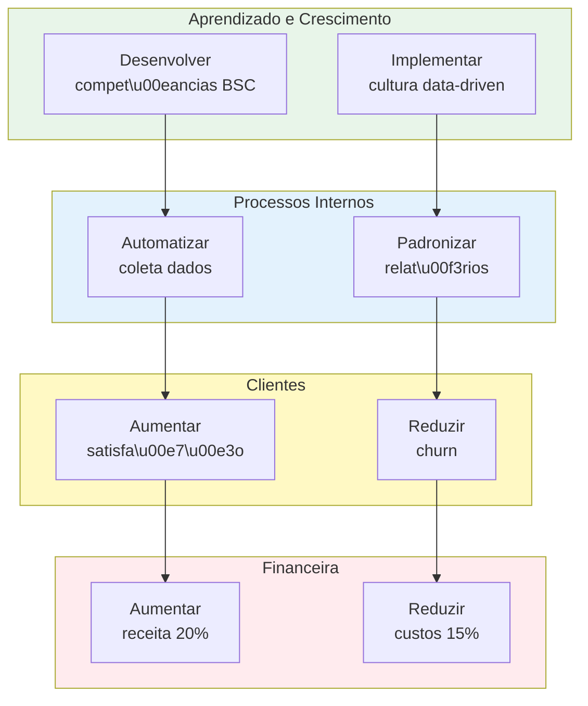

# SPRINT 4 - UI Streamlit: Visualiza\u00e7\u00e3o Strategy Map + Action Plan

**Data:** Novembro 21, 2025
**Sess\u00e3o:** 40
**Status:** Em Design
**Complexidade:** \u2b50\u2b50\u2b50 M\u00e9dia
**Estimativa:** 6-8 horas

---

## \ud83c\udfaf OBJETIVO

Criar interface Streamlit interativa para visualizar **Strategy Map BSC** (4 perspectivas + conex\u00f5es causa-efeito) e **Action Plan** (timeline Gantt + tabela a\u00e7\u00f5es) gerados pelo workflow consultivo.

**Entradas:** Outputs do `StrategicObjectivesTool` (SOLUTION_DESIGN phase) e `ActionPlanTool` (IMPLEMENTATION phase).

**Sa\u00eddas:** 3 p\u00e1ginas Streamlit interativas + Dashboard executivo com KPIs consolidados.

---

## \ud83d\udcda RESEARCH BRIGHTDATA (Nov 2025)

### Strategy Map Visualization

**Fontes Validadas:**
- Medium "Build a Simple Network Graph App Using Streamlit" (200+ likes, 2022)
- Pyvis for Interactive Network Graphs (820+ likes, 2020)
- yFiles Graphs for Streamlit (component oficial, 2024)
- st-link-analysis (novo component, Junho 2024)

**Stack Escolhido:** NetworkX (grafo) + Plotly (visualiza\u00e7\u00e3o interativa HTML)

**Justificativa:** NetworkX \u00e9 library Python madura para grafos, Plotly permite customiza\u00e7\u00e3o completa e interatividade (zoom, pan, hover, click). Integra\u00e7\u00e3o nativa com Streamlit via `st.plotly_chart()`.

### Gantt Chart Visualization

**Fontes Validadas:**
- Gantt Project Planner (app Streamlit validado, 2024)
- Medium "Simple Project Planning App Using Streamlit and Gantt chart" (160+ likes, 2022)
- streamlit-timeline component (vis.js wrapper, 2022)

**Stack Escolhido:** Plotly Express Timeline (nativo Python)

**Justificativa:** Plotly tem suporte nativo para timeline/Gantt (`px.timeline()`). Mais simples que wrapping vis.js, melhor integra\u00e7\u00e3o com Pandas DataFrame, permite customiza\u00e7\u00e3o completa de cores/tooltips.

---

## \ud83c\udfdb\ufe0f ARQUITETURA UI

### Estrutura de P\u00e1ginas

```
app.py (root Streamlit app)
\u251c\u2500\u2500 ui/
\u2502   \u251c\u2500\u2500 pages/
\u2502   \u2502   \u251c\u2500\u2500 1_strategy_map.py       # Strategy Map BSC
\u2502   \u2502   \u251c\u2500\u2500 2_action_plan.py         # Timeline Gantt
\u2502   \u2502   \u2514\u2500\u2500 3_dashboard.py           # Dashboard executivo
\u2502   \u2502
\u2502   \u251c\u2500\u2500 components/
\u2502   \u2502   \u251c\u2500\u2500 bsc_network_graph.py    # NetworkX + Plotly graph
\u2502   \u2502   \u251c\u2500\u2500 gantt_timeline.py       # Plotly timeline
\u2502   \u2502   \u251c\u2500\u2500 filters.py              # Filtros reutiliz\u00e1veis
\u2502   \u2502   \u2514\u2500\u2500 metrics.py              # KPIs calculados
\u2502   \u2502
\u2502   \u2514\u2500\u2500 styles/
\u2502       \u2514\u2500\u2500 bsc_colors.py           # Cores BSC consistentes
\u2502
\u2514\u2500\u2500 tests/
    \u251c\u2500\u2500 test_ui_strategy_map.py
    \u251c\u2500\u2500 test_ui_action_plan.py
    \u2514\u2500\u2500 test_ui_dashboard.py
```

### Stack T\u00e9cnico

| Biblioteca | Vers\u00e3o | Prop\u00f3sito |
|---|---|---|
| streamlit | 1.30+ | Framework UI |
| plotly | 5.18+ | Visualiza\u00e7\u00f5es interativas |
| networkx | 3.2+ | Grafo Strategy Map |
| pandas | 2.1+ | Manipula\u00e7\u00e3o dados Gantt |
| pydantic | 2.5+ | Schemas (j\u00e1 existente) |

**IMPORTANTE:** ZERO emojis no c\u00f3digo (mem\u00f3ria [[9776249]], Windows cp1252). Usar ASCII: [OK], [ERRO], [INFO].

---

## \ud83c\udfa8 MOCKUP CONCEITUAL

### Strategy Map BSC (Network Graph)



**Intera\u00e7\u00f5es:**
- Hover no n\u00f3: tooltip com `name`, `description`, `related_kpis`
- Click no n\u00f3: expande painel lateral com `success_criteria`, `timeframe`, `priority`
- Zoom/Pan: Plotly nativo
- Filtro por perspectiva: highlight apenas 1, outros opacidade 30%
- Conex\u00f5es: setas direcionadas baseadas em `dependencies` field

### Action Plan Gantt

```
Linha do Tempo (Nov 2025 - Jun 2026)

A\u00e7\u00f5es:
[==========HIGH=========]  Implementar sistema BSC          (Dire\u00e7\u00e3o)
   [======MEDIUM======]    Treinar equipes                  (RH)
      [====LOW====]        Ajustar processos                (Opera\u00e7\u00f5es)
```

**Intera\u00e7\u00f5es:**
- Hover na barra: tooltip com `action_title`, `responsible`, `resources_needed`
- Click na barra: expande painel com `description`, `success_criteria`, `dependencies`
- Filtros: Perspectiva (multiselect), Priority (HIGH/MEDIUM/LOW), Respons\u00e1vel
- Timeline zoom: slider de datas (`start_date` min \u2192 `due_date` max)
- Tabela embaixo: sortable, filterable, exportable CSV

---

## \ud83d\udce6 COMPONENTES DETALHADOS

### 1. bsc_network_graph.py

```python
# ui/components/bsc_network_graph.py

import networkx as nx
import plotly.graph_objects as go
from typing import List
from src.memory.schemas import StrategicObjective

class BSCNetworkGraph:
    """Componente NetworkX + Plotly para Strategy Map BSC.

    Cria grafo direcionado com 4 perspectivas BSC, posicionamento hier\u00e1rquico,
    conex\u00f5es causa-efeito baseadas em dependencies, e customiza\u00e7\u00e3o de cores.
    """

    PERSPECTIVE_COLORS = {
        "Financeira": "#FFEBEE",
        "Clientes": "#FFF9C4",
        "Processos Internos": "#E3F2FD",
        "Aprendizado e Crescimento": "#E8F5E9"
    }

    def __init__(self, objectives: List[StrategicObjective]):
        self.objectives = objectives
        self.graph = nx.DiGraph()

    def build_graph(self) -> nx.DiGraph:
        """Constr\u00f3i grafo direcionado com n\u00f3s (objectives) e arestas (dependencies)."""
        # Adicionar n\u00f3s
        for obj in self.objectives:
            self.graph.add_node(
                obj.name,
                perspective=obj.perspective,
                description=obj.description,
                priority=obj.priority,
                related_kpis=obj.related_kpis,
                success_criteria=obj.success_criteria,
                timeframe=obj.timeframe
            )

        # Adicionar arestas (dependencies)
        for obj in self.objectives:
            if obj.dependencies:
                for dep in obj.dependencies:
                    # Aresta: depend\u00eancia -> objetivo atual (causa -> efeito)
                    self.graph.add_edge(dep, obj.name)

        return self.graph

    def create_plotly_figure(
        self,
        filter_perspective: str = None,
        filter_priority: List[str] = None
    ) -> go.Figure:
        """Cria figura Plotly interativa do grafo.

        Args:
            filter_perspective: Perspectiva para highlight (outras ficam opacas)
            filter_priority: Lista de prioridades para mostrar (ex: ["Alta"])

        Returns:
            go.Figure: Figura Plotly pronta para st.plotly_chart()
        """
        # Layout hier\u00e1rquico (4 camadas: Aprendizado -> Processos -> Clientes -> Financeira)
        pos = self._hierarchical_layout()

        # Criar traces de arestas (conex\u00f5es)
        edge_trace = self._create_edge_trace(pos)

        # Criar traces de n\u00f3s (objectives)
        node_trace = self._create_node_trace(pos, filter_perspective, filter_priority)

        # Criar figura
        fig = go.Figure(
            data=[edge_trace, node_trace],
            layout=go.Layout(
                title="Strategy Map BSC - Conex\u00f5es Causa-Efeito",
                showlegend=True,
                hovermode='closest',
                margin=dict(b=20, l=5, r=5, t=40),
                xaxis=dict(showgrid=False, zeroline=False, showticklabels=False),
                yaxis=dict(showgrid=False, zeroline=False, showticklabels=False),
                plot_bgcolor='white'
            )
        )

        return fig

    def _hierarchical_layout(self) -> dict:
        """Layout hier\u00e1rquico com 4 camadas verticais."""
        # Agrupar por perspectiva
        by_perspective = {
            "Financeira": [],
            "Clientes": [],
            "Processos Internos": [],
            "Aprendizado e Crescimento": []
        }

        for node in self.graph.nodes():
            persp = self.graph.nodes[node]['perspective']
            by_perspective[persp].append(node)

        # Posicionar n\u00f3s (y baseado em perspectiva, x distribuir igualmente)
        pos = {}
        y_levels = {
            "Financeira": 3,
            "Clientes": 2,
            "Processos Internos": 1,
            "Aprendizado e Crescimento": 0
        }

        for persp, nodes in by_perspective.items():
            y = y_levels[persp]
            for i, node in enumerate(nodes):
                x = (i + 1) / (len(nodes) + 1)  # Distribuir entre 0 e 1
                pos[node] = (x, y)

        return pos

    def _create_edge_trace(self, pos: dict) -> go.Scatter:
        """Cria trace de arestas (setas direcionadas)."""
        edge_x = []
        edge_y = []

        for edge in self.graph.edges():
            x0, y0 = pos[edge[0]]
            x1, y1 = pos[edge[1]]
            edge_x.extend([x0, x1, None])
            edge_y.extend([y0, y1, None])

        return go.Scatter(
            x=edge_x,
            y=edge_y,
            line=dict(width=2, color='#888'),
            hoverinfo='none',
            mode='lines',
            showlegend=False
        )

    def _create_node_trace(
        self,
        pos: dict,
        filter_perspective: str,
        filter_priority: List[str]
    ) -> go.Scatter:
        """Cria trace de n\u00f3s com customiza\u00e7\u00e3o de cores e opacidade."""
        node_x = []
        node_y = []
        node_color = []
        node_text = []
        node_hover = []
        node_opacity = []

        for node in self.graph.nodes():
            x, y = pos[node]
            node_x.append(x)
            node_y.append(y)

            # Dados do n\u00f3
            persp = self.graph.nodes[node]['perspective']
            priority = self.graph.nodes[node]['priority']
            desc = self.graph.nodes[node]['description']
            kpis = self.graph.nodes[node]['related_kpis']

            # Filtros
            if filter_perspective and persp != filter_perspective:
                opacity = 0.3
            elif filter_priority and priority not in filter_priority:
                opacity = 0.3
            else:
                opacity = 1.0

            node_opacity.append(opacity)

            # Cor baseada em perspectiva
            color = self.PERSPECTIVE_COLORS.get(persp, '#CCCCCC')
            node_color.append(color)

            # Texto do n\u00f3
            node_text.append(node)

            # Hover info
            hover_text = f"<b>{node}</b><br>"
            hover_text += f"Perspectiva: {persp}<br>"
            hover_text += f"Prioridade: {priority}<br>"
            hover_text += f"Descri\u00e7\u00e3o: {desc[:100]}...<br>"
            hover_text += f"KPIs: {', '.join(kpis[:3])}"
            node_hover.append(hover_text)

        return go.Scatter(
            x=node_x,
            y=node_y,
            mode='markers+text',
            hoverinfo='text',
            text=node_text,
            hovertext=node_hover,
            textposition="top center",
            marker=dict(
                showscale=False,
                color=node_color,
                size=30,
                opacity=node_opacity,
                line_width=2
            ),
            showlegend=False
        )
```

**Testes Smoke:**
```python
# tests/test_ui_strategy_map.py

def test_build_graph_creates_nodes():
    """Valida que grafo cria n\u00f3s para cada objetivo."""
    objectives = [
        StrategicObjective(name="Obj1", perspective="Financeira", ...),
        StrategicObjective(name="Obj2", perspective="Clientes", ...)
    ]
    graph_component = BSCNetworkGraph(objectives)
    graph = graph_component.build_graph()

    assert len(graph.nodes()) == 2
    assert "Obj1" in graph.nodes()
    assert "Obj2" in graph.nodes()

def test_dependencies_create_edges():
    """Valida que dependencies criam arestas no grafo."""
    obj1 = StrategicObjective(name="Obj1", perspective="Aprendizado e Crescimento", dependencies=[])
    obj2 = StrategicObjective(name="Obj2", perspective="Financeira", dependencies=["Obj1"])

    graph_component = BSCNetworkGraph([obj1, obj2])
    graph = graph_component.build_graph()

    assert graph.has_edge("Obj1", "Obj2")

def test_filter_perspective_changes_opacity():
    """Valida que filtro de perspectiva altera opacidade."""
    objectives = [...]
    graph_component = BSCNetworkGraph(objectives)
    fig = graph_component.create_plotly_figure(filter_perspective="Financeira")

    # Validar que n\u00f3s Financeira t\u00eam opacity=1.0 e outros 0.3
    node_trace = fig.data[1]  # Segundo trace s\u00e3o os n\u00f3s
    assert any(op == 1.0 for op in node_trace.marker.opacity)
    assert any(op == 0.3 for op in node_trace.marker.opacity)

def test_plotly_figure_renders_without_error():
    """Smoke test: valida que figura Plotly \u00e9 criada sem erro."""
    objectives = [...]
    graph_component = BSCNetworkGraph(objectives)
    fig = graph_component.create_plotly_figure()

    assert isinstance(fig, go.Figure)
    assert len(fig.data) == 2  # Edge trace + Node trace
```

---

### 2. gantt_timeline.py

```python
# ui/components/gantt_timeline.py

import plotly.express as px
import pandas as pd
from typing import List
from src.memory.schemas import ActionItem

class GanttTimeline:
    """Componente Plotly Express para timeline Gantt de Action Plan.

    Cria timeline interativo com barras por action, cores por prioridade,
    tooltips informativos e zoom temporal.
    """

    PRIORITY_COLORS = {
        "HIGH": "#EF5350",      # Vermelho
        "MEDIUM": "#FFA726",    # Laranja
        "LOW": "#66BB6A"        # Verde
    }

    def __init__(self, action_items: List[ActionItem]):
        self.action_items = action_items

    def create_dataframe(
        self,
        filter_perspective: List[str] = None,
        filter_priority: List[str] = None,
        filter_responsible: List[str] = None
    ) -> pd.DataFrame:
        """Converte ActionItems para DataFrame Pandas com filtros aplicados."""
        data = []

        for action in self.action_items:
            # Aplicar filtros
            if filter_perspective and action.perspective not in filter_perspective:
                continue
            if filter_priority and action.priority not in filter_priority:
                continue
            if filter_responsible and action.responsible not in filter_responsible:
                continue

            data.append({
                "Action": action.action_title,
                "Start": action.start_date,
                "Finish": action.due_date,
                "Priority": action.priority,
                "Effort": action.effort,
                "Responsible": action.responsible,
                "Perspective": action.perspective,
                "Description": action.description,
                "Resources": ", ".join(action.resources_needed),
                "Success_Criteria": action.success_criteria
            })

        return pd.DataFrame(data)

    def create_plotly_figure(
        self,
        df: pd.DataFrame
    ) -> px.timeline:
        """Cria figura Plotly timeline (Gantt chart)."""
        if df.empty:
            # Retornar figura vazia com mensagem
            fig = go.Figure()
            fig.add_annotation(
                text="Nenhuma a\u00e7\u00e3o corresponde aos filtros selecionados",
                xref="paper", yref="paper",
                x=0.5, y=0.5, showarrow=False,
                font=dict(size=16, color="gray")
            )
            return fig

        # Criar timeline
        fig = px.timeline(
            df,
            x_start="Start",
            x_end="Finish",
            y="Action",
            color="Priority",
            color_discrete_map=self.PRIORITY_COLORS,
            hover_data={
                "Responsible": True,
                "Resources": True,
                "Effort": True,
                "Start": False,
                "Finish": False
            },
            title="Action Plan Timeline (Gantt Chart)"
        )

        # Customiza\u00e7\u00e3o layout
        fig.update_layout(
            xaxis_title="Timeline",
            yaxis_title="A\u00e7\u00f5es",
            height=600,
            showlegend=True,
            legend_title="Prioridade"
        )

        # Ordenar por data de in\u00edcio
        fig.update_yaxes(categoryorder="total ascending")

        return fig

    def create_details_table(self, df: pd.DataFrame) -> pd.DataFrame:
        """Cria DataFrame formatado para exibi\u00e7\u00e3o em tabela Streamlit."""
        if df.empty:
            return pd.DataFrame()

        table_df = df[[
            "Action",
            "Priority",
            "Responsible",
            "Start",
            "Finish",
            "Perspective"
        ]].copy()

        # Renomear colunas para portugu\u00eas
        table_df.columns = [
            "A\u00e7\u00e3o",
            "Prioridade",
            "Respons\u00e1vel",
            "In\u00edcio",
            "Prazo",
            "Perspectiva"
        ]

        return table_df
```

**Testes Smoke:**
```python
# tests/test_ui_action_plan.py

def test_create_dataframe_filters_perspective():
    """Valida que filtro de perspectiva funciona."""
    actions = [
        ActionItem(perspective="Financeira", ...),
        ActionItem(perspective="Clientes", ...)
    ]
    gantt = GanttTimeline(actions)
    df = gantt.create_dataframe(filter_perspective=["Financeira"])

    assert len(df) == 1
    assert df.iloc[0]["Perspective"] == "Financeira"

def test_create_plotly_figure_renders():
    """Smoke test: valida que figura Plotly \u00e9 criada."""
    actions = [...]
    gantt = GanttTimeline(actions)
    df = gantt.create_dataframe()
    fig = gantt.create_plotly_figure(df)

    assert isinstance(fig, go.Figure) or isinstance(fig, px.timeline)

def test_empty_dataframe_shows_message():
    """Valida que DataFrame vazio mostra mensagem ao inv\u00e9s de erro."""
    gantt = GanttTimeline([])
    df = gantt.create_dataframe()
    fig = gantt.create_plotly_figure(df)

    # Figura deve ter annotation de mensagem
    assert len(fig.layout.annotations) > 0

def test_details_table_renames_columns():
    """Valida que tabela de detalhes renomeia colunas para portugu\u00eas."""
    actions = [...]
    gantt = GanttTimeline(actions)
    df = gantt.create_dataframe()
    table = gantt.create_details_table(df)

    assert "A\u00e7\u00e3o" in table.columns
    assert "Prioridade" in table.columns
    assert "Respons\u00e1vel" in table.columns
```

---

### 3. filters.py

```python
# ui/components/filters.py

import streamlit as st
from typing import List, Tuple

class BSCFilters:
    """Componente de filtros reutiliz\u00e1veis para Strategy Map e Action Plan."""

    @staticmethod
    def perspective_filter(
        key: str = "perspective_filter",
        default: List[str] = None
    ) -> List[str]:
        """Multiselect de perspectivas BSC."""
        perspectives = [
            "Financeira",
            "Clientes",
            "Processos Internos",
            "Aprendizado e Crescimento"
        ]

        selected = st.multiselect(
            "Filtrar por Perspectiva:",
            options=perspectives,
            default=default or perspectives,
            key=key
        )

        return selected

    @staticmethod
    def priority_filter(
        key: str = "priority_filter",
        default: List[str] = None
    ) -> List[str]:
        """Multiselect de prioridades."""
        priorities = ["HIGH", "MEDIUM", "LOW"]

        selected = st.multiselect(
            "Filtrar por Prioridade:",
            options=priorities,
            default=default or priorities,
            key=key
        )

        return selected

    @staticmethod
    def date_range_filter(
        min_date: str,
        max_date: str,
        key: str = "date_filter"
    ) -> Tuple[str, str]:
        """Slider de range de datas."""
        from datetime import datetime

        min_dt = datetime.fromisoformat(min_date)
        max_dt = datetime.fromisoformat(max_date)

        selected = st.slider(
            "Filtrar por Per\u00edodo:",
            min_value=min_dt,
            max_value=max_dt,
            value=(min_dt, max_dt),
            key=key
        )

        return selected[0].isoformat(), selected[1].isoformat()
```

---

## \ud83d\udcca P\u00c1GINAS STREAMLIT

### 1_strategy_map.py

```python
# ui/pages/1_strategy_map.py

import streamlit as st
from ui.components.bsc_network_graph import BSCNetworkGraph
from ui.components.filters import BSCFilters
from src.memory.mem0_client import Mem0Manager

st.set_page_config(page_title="Strategy Map BSC", layout="wide")

st.title("Strategy Map BSC - Conex\u00f5es Causa-Efeito")

# Carregar objectives do Mem0
@st.cache_data
def load_objectives():
    mem0 = Mem0Manager()
    # Buscar StrategicObjectivesFramework salvo pelo StrategicObjectivesTool
    # TODO: Implementar busca no Mem0 com filtro por tipo de documento
    objectives = []  # Lista de StrategicObjective
    return objectives

objectives = load_objectives()

if not objectives:
    st.warning("Nenhum objetivo estrat\u00e9gico encontrado. Execute a fase SOLUTION_DESIGN primeiro.")
    st.stop()

# Filtros na sidebar
with st.sidebar:
    st.header("Filtros")

    filter_persp = BSCFilters.perspective_filter(
        key="strategy_map_perspective",
        default=["Financeira", "Clientes", "Processos Internos", "Aprendizado e Crescimento"]
    )

    filter_prior = BSCFilters.priority_filter(
        key="strategy_map_priority",
        default=["Alta", "Media", "Baixa"]
    )

# Criar grafo
graph_component = BSCNetworkGraph(objectives)
graph = graph_component.build_graph()

# Estat\u00edsticas r\u00e1pidas
col1, col2, col3, col4 = st.columns(4)

with col1:
    st.metric("Total Objetivos", len(objectives))
with col2:
    high_count = len([o for o in objectives if o.priority == "Alta"])
    st.metric("Alta Prioridade", high_count)
with col3:
    st.metric("Conex\u00f5es", graph.number_of_edges())
with col4:
    perspectives = set([o.perspective for o in objectives])
    st.metric("Perspectivas", len(perspectives))

# Visualiza\u00e7\u00e3o
fig = graph_component.create_plotly_figure(
    filter_perspective=filter_persp[0] if len(filter_persp) == 1 else None,
    filter_priority=filter_prior
)

st.plotly_chart(fig, use_container_width=True)

# Detalhes por perspectiva
st.subheader("Detalhes por Perspectiva")

for persp in ["Financeira", "Clientes", "Processos Internos", "Aprendizado e Crescimento"]:
    if persp not in filter_persp:
        continue

    persp_objs = [o for o in objectives if o.perspective == persp]

    with st.expander(f"{persp} ({len(persp_objs)} objetivos)", expanded=False):
        for obj in persp_objs:
            st.markdown(f"**{obj.name}**")
            st.write(f"- Prioridade: {obj.priority}")
            st.write(f"- Prazo: {obj.timeframe}")
            st.write(f"- KPIs: {', '.join(obj.related_kpis)}")
            st.write(f"- Crit\u00e9rios de Sucesso:")
            for criteria in obj.success_criteria:
                st.write(f"  - {criteria}")
            st.divider()
```

### 2_action_plan.py

```python
# ui/pages/2_action_plan.py

import streamlit as st
from ui.components.gantt_timeline import GanttTimeline
from ui.components.filters import BSCFilters

st.set_page_config(page_title="Action Plan", layout="wide")

st.title("Action Plan - Timeline de Implementa\u00e7\u00e3o BSC")

# Carregar action items
@st.cache_data
def load_action_items():
    # TODO: Buscar ActionPlan do Mem0 (salvo por ActionPlanTool)
    action_items = []
    return action_items

actions = load_action_items()

if not actions:
    st.warning("Nenhum plano de a\u00e7\u00e3o encontrado. Execute a fase IMPLEMENTATION primeiro.")
    st.stop()

# Filtros na sidebar
with st.sidebar:
    st.header("Filtros")

    filter_persp = BSCFilters.perspective_filter(key="action_plan_perspective")
    filter_prior = BSCFilters.priority_filter(key="action_plan_priority")

    # Filtro de respons\u00e1vel
    all_responsibles = sorted(set([a.responsible for a in actions]))
    filter_resp = st.multiselect(
        "Filtrar por Respons\u00e1vel:",
        options=all_responsibles,
        default=all_responsibles,
        key="action_plan_responsible"
    )

# KPIs do Action Plan
col1, col2, col3, col4 = st.columns(4)

with col1:
    st.metric("Total A\u00e7\u00f5es", len(actions))
with col2:
    high_count = len([a for a in actions if a.priority == "HIGH"])
    st.metric("Alta Prioridade", high_count, delta=f"{high_count/len(actions)*100:.0f}%")
with col3:
    efforts = [a.effort for a in actions]
    avg_effort = efforts.count("HIGH") / len(efforts) * 100
    st.metric("Esfor\u00e7o Alto", f"{avg_effort:.0f}%")
with col4:
    responsibles = set([a.responsible for a in actions])
    st.metric("Respons\u00e1veis", len(responsibles))

# Gantt Chart
st.subheader("Timeline Gantt")

gantt_component = GanttTimeline(actions)
df = gantt_component.create_dataframe(
    filter_perspective=filter_persp,
    filter_priority=filter_prior,
    filter_responsible=filter_resp
)

fig = gantt_component.create_plotly_figure(df)
st.plotly_chart(fig, use_container_width=True)

# Tabela de detalhes
st.subheader("Detalhes das A\u00e7\u00f5es")

table_df = gantt_component.create_details_table(df)

if not table_df.empty:
    # Tabela interativa
    st.dataframe(
        table_df,
        use_container_width=True,
        hide_index=True
    )

    # Bot\u00e3o de export CSV
    csv = table_df.to_csv(index=False).encode('utf-8')
    st.download_button(
        label="Exportar CSV",
        data=csv,
        file_name="action_plan.csv",
        mime="text/csv"
    )
else:
    st.info("Nenhuma a\u00e7\u00e3o corresponde aos filtros selecionados.")
```

### 3_dashboard.py

```python
# ui/pages/3_dashboard.py

import streamlit as st
from ui.components.metrics import BSCMetrics

st.set_page_config(page_title="Dashboard Executivo", layout="wide")

st.title("Dashboard Executivo BSC")

# Carregar dados
objectives = []  # TODO: Buscar do Mem0
actions = []     # TODO: Buscar do Mem0

if not objectives or not actions:
    st.warning("Dados insuficientes. Execute SOLUTION_DESIGN e IMPLEMENTATION primeiro.")
    st.stop()

# KPIs consolidados
st.subheader("KPIs Consolidados")

col1, col2, col3, col4 = st.columns(4)

with col1:
    st.metric(
        label="Objetivos Estrat\u00e9gicos",
        value=len(objectives),
        delta=f"{len([o for o in objectives if o.priority=='Alta'])} alta prioridade"
    )

with col2:
    st.metric(
        label="A\u00e7\u00f5es Planejadas",
        value=len(actions),
        delta=f"{len([a for a in actions if a.priority=='HIGH'])}/{len(actions)} cr\u00edticas"
    )

with col3:
    total_kpis = sum([len(o.related_kpis) for o in objectives])
    st.metric(
        label="KPIs Definidos",
        value=total_kpis,
        delta=f"{total_kpis/len(objectives):.1f} por objetivo"
    )

with col4:
    responsibles = set([a.responsible for a in actions])
    st.metric(
        label="Envolvidos",
        value=len(responsibles)
    )

# Progress por perspectiva
st.subheader("Distribui\u00e7\u00e3o por Perspectiva BSC")

for persp in ["Financeira", "Clientes", "Processos Internos", "Aprendizado e Crescimento"]:
    persp_objs = len([o for o in objectives if o.perspective == persp])
    persp_actions = len([a for a in actions if a.perspective == persp])

    col1, col2, col3 = st.columns([2, 1, 1])

    with col1:
        st.write(f"**{persp}**")
    with col2:
        st.write(f"{persp_objs} objetivos")
    with col3:
        st.write(f"{persp_actions} a\u00e7\u00f5es")

    # Progress bar (simula\u00e7\u00e3o - no futuro, calcular real)
    progress = persp_actions / len(actions) if actions else 0
    st.progress(progress)
    st.divider()

# Export completo
st.subheader("Export Completo")

col1, col2 = st.columns(2)

with col1:
    if st.button("Exportar Strategy Map (PNG)"):
        # TODO: Implementar export Plotly para PNG
        st.success("Strategy Map exportado!")

with col2:
    if st.button("Exportar Action Plan (CSV)"):
        # TODO: Implementar export CSV
        st.success("Action Plan exportado!")
```

---

## \ud83e\uddea TESTES SMOKE (10-12 testes)

### test_ui_strategy_map.py (4 testes)

```python
def test_build_graph_creates_nodes()
def test_dependencies_create_edges()
def test_filter_perspective_changes_opacity()
def test_plotly_figure_renders_without_error()
```

### test_ui_action_plan.py (4 testes)

```python
def test_create_dataframe_filters_perspective()
def test_create_plotly_figure_renders()
def test_empty_dataframe_shows_message()
def test_details_table_renames_columns()
```

### test_ui_dashboard.py (3 testes)

```python
def test_metrics_calculation()
def test_progress_bars_percentage()
def test_responsive_layout_columns()
```

**Pattern de Testes (mem\u00f3ria [[10267391]]):**
- SEMPRE validar FUNCIONALIDADE (dados renderizados, filtros funcionam)
- NUNCA validar texto espec\u00edfico (frágil, LLM non-deterministic)
- Usar functional assertions: `assert len(df) == expected`, `assert isinstance(fig, go.Figure)`

---

## \ud83d\udccb CHECKLIST IMPLEMENTA\u00c7\u00c3O

### Step 1: Setup (30 min)
- [ ] Adicionar dependencies: `networkx`, `plotly`, `pandas` em `requirements.txt`
- [ ] Criar estrutura de diretórios: `ui/pages/`, `ui/components/`, `ui/styles/`
- [ ] Criar `ui/styles/bsc_colors.py` com cores BSC consistentes

### Step 2: Components (4h)
- [ ] Implementar `bsc_network_graph.py` (NetworkX + Plotly) - 2h
- [ ] Implementar `gantt_timeline.py` (Plotly timeline) - 1.5h
- [ ] Implementar `filters.py` (widgets reutilizáveis) - 30 min

### Step 3: Pages (1.5h)
- [ ] Criar `1_strategy_map.py` - 30 min
- [ ] Criar `2_action_plan.py` - 30 min
- [ ] Criar `3_dashboard.py` - 30 min

### Step 4: Testes Smoke (1.5h)
- [ ] `test_ui_strategy_map.py` (4 testes) - 30 min
- [ ] `test_ui_action_plan.py` (4 testes) - 30 min
- [ ] `test_ui_dashboard.py` (3 testes) - 30 min
- [ ] Executar suite completa: `pytest tests/test_ui_*.py -v`

### Step 5: Integração (1h)
- [ ] Integrar carregamento de dados do Mem0 (StrategicObjectivesFramework, ActionPlan)
- [ ] Validar workflow end-to-end: ONBOARDING → DISCOVERY → APPROVAL → SOLUTION_DESIGN → IMPLEMENTATION → UI
- [ ] Debug e ajustes finais

---

## \ud83d\udcca ROI ESPERADO

**Valor UX:**
- Visualização interativa Strategy Map BSC (vs texto simples)
- Timeline Gantt profissional (vs tabela estática)
- Dashboard executivo com KPIs consolidados (insights rápidos)

**Diferencial Competitivo:**
- Sistemas BSC genéricos não têm visualização de conexões causa-efeito
- Export funcionalidade (PNG, CSV) para apresentações executivas
- Interface moderna e intuitiva (Streamlit + Plotly)

**Estimativa Valor:**
- 6-8h implementação
- 10-12 testes smoke (cobertura funcional)
- Stack técnico maduro (NetworkX, Plotly)
- Complexidade média, ROI alto

---

## \ud83d\udd17 REFERÊNCIAS

### Brightdata Research (Nov 2025)
- Medium "Build a Simple Network Graph App Using Streamlit" (2022)
- Medium "Simple Project Planning App Using Streamlit and Gantt chart" (2022)
- Plotly Docs: Network Graphs, Timeline Charts
- NetworkX Docs: DiGraph, Layout Algorithms

### Padrões do Projeto
- @.cursor/rules/derived-cursor-rules.mdc (Streamlit best practices, mem [[10230062]])
- @docs/sprints/SPRINT_3_IMPLEMENTATION.md (pattern validado)
- @docs/architecture/AGENTS_WORKFLOW.md (exemplo Mermaid)

### Memórias Críticas
- [[9776249]] - Zero emojis código (Windows cp1252)
- [[10267391]] - LLM Testing Strategy (functional assertions)
- [[9969868]] - PONTO 15 checklist (grep schemas antes fixtures)
- [[10230062]] - Streamlit UI patterns (columns, expanders, metrics)

---

**DECISÃO:** ✅ GO! Stack técnico validado, complexidade gerenciável, ROI alto.

**Próximo:** Implementar Step 1 (Setup + Dependencies).
