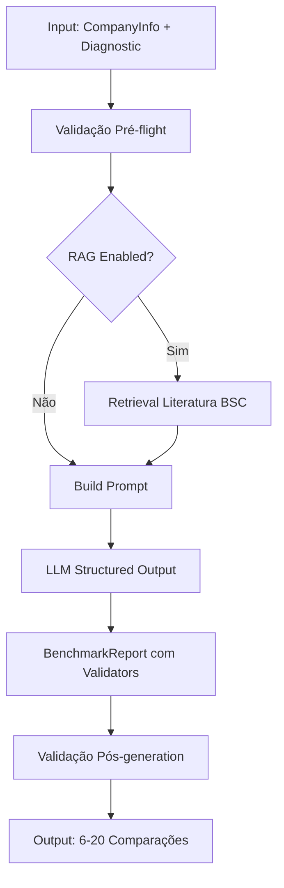

# Benchmarking Tool - Documentação Técnica

**Tool consultiva 6/7 da FASE 3 (Workflow Consultivo Completo)**

**Status**: ✅ Implementada e testada (2025-10-19)

**Autor**: BSC RAG System (Sessão 21)

---

## 📋 Índice

1. [Visão Geral](#visão-geral)
2. [Arquitetura](#arquitetura)
3. [Casos de Uso BSC](#casos-de-uso-bsc)
4. [API Reference](#api-reference)
5. [Schemas Pydantic](#schemas-pydantic)
6. [Prompts e Context Builders](#prompts-e-context-builders)
7. [Integração DiagnosticAgent](#integração-diagnosticagent)
8. [Testes Unitários](#testes-unitários)
9. [Troubleshooting](#troubleshooting)
10. [Métricas e Validação](#métricas-e-validação)

---

## Visão Geral

### O Que É?

A **Benchmarking Tool** compara o desempenho da empresa cliente com benchmarks externos de mercado nas 4 perspectivas BSC (Financeira, Clientes, Processos Internos, Aprendizado e Crescimento).

### Por Que Existe?

**Problema resolvido**: Empresas precisam contextu alizar seu desempenho BSC em relação ao mercado para entender se gaps identificados são críticos ou aceitáveis.

**Antes**: Diagnóstico BSC isolado sem referência externa  
**Depois**: Comparação contextualizada com benchmarks setoriais específicos

### Quando Usar?

**Timing**: Após diagnóstico BSC completo (4 perspectivas) e opcionalmente após definição de KPIs

**Input mínimo**:
- ✅ `CompanyInfo` (setor, porte, região)
- ✅ Diagnóstico BSC das 4 perspectivas (`dict[str, DiagnosticResult]`)

**Output**: `BenchmarkReport` com 6-20 comparações balanceadas, gaps priorizados, recomendações

---

## Arquitetura

### Componentes Principais

```
src/tools/benchmarking_tool.py (409 linhas)
├── BenchmarkingTool
│   ├── __init__(llm, retriever=None)
│   └── generate_benchmarks(company_info, diagnostic, kpi_framework, use_rag)
│
src/prompts/benchmarking_prompts.py (388 linhas)
├── MAIN_BENCHMARKING_PROMPT
├── build_company_context(company_info)
├── build_diagnostic_context(diagnostic)
├── build_kpi_context(kpi_framework)
├── build_rag_context(docs, query)
└── format_benchmarking_prompt(...)
│
src/memory/schemas.py (316 linhas adicionadas)
├── BenchmarkComparison (9 campos + 3 validators)
└── BenchmarkReport (4 campos + 2 model_validators + 4 métodos)
```

### Workflow de Geração



### Tecnologias

- **LLM**: gpt-5-mini-2025-08-07 (custo-benefício ideal para benchmarking)
- **Structured Output**: Pydantic V2 com validators customizados
- **RAG**: Opcional (literatura BSC de Kaplan & Norton)
- **Validações**: 5 validators Pydantic (gaps realistas, balanceamento, sources específicas)

---

## Casos de Uso BSC

### Caso 1: SaaS B2B Médio Porte - Margem EBITDA Abaixo

**Contexto**: Startup SaaS crescendo 25% ao ano mas com margem EBITDA de apenas 18%

**Input**:
```python
company_info = CompanyInfo(
    name="TechCorp Brasil",
    sector="Tecnologia",
    industry="Software as a Service (SaaS)",
    size="média",
    region="Brasil"
)

diagnostic = {
    "Financeira": DiagnosticResult(
        perspective="Financeira",
        current_state="Receita recorrente crescendo 25% ao ano mas margem EBITDA de apenas 18%",
        gaps=["Custos operacionais elevados", "Pricing subotimizado"],
        opportunities=["Implementar ABC Costing", "Revisar pricing strategy"],
        priority="HIGH"
    ),
    # ... outras 3 perspectivas
}
```

**Output Esperado**:
```
BenchmarkComparison(
    perspective="Financeira",
    metric_name="Margem EBITDA",
    company_value="18%",
    benchmark_value="25%",  # Setor SaaS B2B médio porte
    gap=7.0,  # 7pp abaixo
    gap_type="negative",
    benchmark_source="Setor Tecnologia SaaS Brasil 2024 (média empresas médio porte B2B - ARR $5-20M)",
    insight="Margem EBITDA 7pp abaixo do mercado indica custos operacionais elevados ou pricing subotimizado",
    priority="HIGH"
)
```

**Ação Recomendada**: Priorizar redução de custos via automação (meta: +7pp EBITDA em 18 meses)

---

### Caso 2: Manufatura - NPS Baixo Impactando Churn

**Contexto**: Indústria manufatura com NPS de 42 pontos (15 abaixo do benchmark) e churn 20% maior que mercado

**Input**:
```python
company_info = CompanyInfo(
    name="Industria XYZ",
    sector="Manufatura",
    industry="Equipamentos Industriais",
    size="grande",
    region="Brasil"
)

diagnostic = {
    "Clientes": DiagnosticResult(
        perspective="Clientes",
        current_state="NPS de 42 pontos está 15 pontos abaixo do benchmark setorial",
        gaps=["Onboarding manual e lento", "Sem programa Voice of Customer"],
        opportunities=["Automatizar onboarding", "Implementar VoC estruturado"],
        priority="HIGH"
    ),
    # ... outras perspectivas
}
```

**Output Esperado**:
```
BenchmarkReport(
    comparisons=[
        BenchmarkComparison(
            perspective="Clientes",
            metric_name="NPS",
            company_value="42 pontos",
            benchmark_value="57 pontos",
            gap=15.0,
            gap_type="negative",
            benchmark_source="NPS B2B Manufatura Brasil 2024 (empresas grande porte)",
            insight="NPS 15 pontos abaixo correlacionado com churn 20% maior - onboarding deficiente",
            priority="HIGH"
        )
    ],
    overall_performance="abaixo_mercado",
    priority_gaps=[
        "NPS 15 pontos abaixo (Clientes) - risco: churn 20% maior que mercado"
    ],
    recommendations=[
        "Implementar programa Voice of Customer estruturado (meta: NPS +15 em 12 meses)"
    ]
)
```

**Impacto Estimado**: Implementar VoC pode aumentar NPS em 15 pontos e reduzir churn em 20%

---

### Caso 3: Varejo - Lead Time Alto Perdendo Oportunidades

**Contexto**: Empresa varejo com Lead Time de 14 dias (40% acima do benchmark de 10 dias)

**Input**:
```python
company_info = CompanyInfo(
    name="Varejo ABC",
    sector="Varejo",
    industry="E-commerce",
    size="média",
    region="Brasil"
)

diagnostic = {
    "Processos Internos": DiagnosticResult(
        perspective="Processos Internos",
        current_state="Lead Time de 14 dias está 40% acima do benchmark devido processos manuais",
        gaps=["Processos manuais em fulfillment", "Falta automação"],
        opportunities=["Automatizar processos críticos", "Implementar workflow engine"],
        priority="MEDIUM"
    ),
    # ... outras perspectivas
}
```

**Output Esperado**:
```
BenchmarkComparison(
    perspective="Processos Internos",
    metric_name="Lead Time",
    company_value="14 dias",
    benchmark_value="10 dias",
    gap=40.0,  # 40% maior
    gap_type="negative",
    benchmark_source="Lead Time E-commerce Brasil 2024 (empresas médio porte)",
    insight="Lead Time 40% maior que benchmark causando perda de 15% oportunidades por lentidão",
    priority="MEDIUM"
)
```

**ROI Estimado**: Reduzir Lead Time para 10 dias pode recuperar 15% oportunidades perdidas

---

### Caso 4: Serviços - Retenção de Talentos No Mercado

**Contexto**: Consultoria com retenção de 85% (no mercado mas sem programa estruturado de desenvolvimento)

**Input**:
```python
company_info = CompanyInfo(
    name="Consultoria Tech",
    sector="Serviços",
    industry="Consultoria de TI",
    size="pequena",
    region="Brasil"
)

diagnostic = {
    "Aprendizado e Crescimento": DiagnosticResult(
        perspective="Aprendizado e Crescimento",
        current_state="Retenção de talentos de 85% está no mercado mas falta programa estruturado",
        gaps=["Sem programa de desenvolvimento estruturado", "Treinamento ad-hoc"],
        opportunities=["Criar programa de desenvolvimento", "Implementar IDP"],
        priority="LOW"
    ),
    # ... outras perspectivas
}
```

**Output Esperado**:
```
BenchmarkComparison(
    perspective="Aprendizado e Crescimento",
    metric_name="Retenção de Talentos",
    company_value="85%",
    benchmark_value="88%",
    gap=3.0,  # Pequeno
    gap_type="neutral",  # < 5 → neutral
    benchmark_source="Retenção Talentos Consultoria TI Brasil 2024 (pequenas empresas)",
    insight="Retenção no mercado mas margem de melhoria com programa estruturado de desenvolvimento e carreira",
    priority="LOW"
)
```

**Recomendação**: Criar programa de desenvolvimento estruturado para alcançar 90%+

---

## API Reference

### BenchmarkingTool.generate_benchmarks()

```python
def generate_benchmarks(
    self,
    company_info: CompanyInfo,
    diagnostic: dict[str, DiagnosticResult],
    kpi_framework: KPIFramework | None = None,
    use_rag: bool = False
) -> BenchmarkReport:
    """Gera relatório de benchmarking BSC completo.
    
    Args:
        company_info: Informações básicas da empresa (setor, porte, região)
        diagnostic: Diagnóstico BSC das 4 perspectivas
        kpi_framework: KPIs existentes com valores atuais (opcional)
        use_rag: Se True, busca contexto na literatura BSC (default: False)
    
    Returns:
        BenchmarkReport com 6-20 comparações balanceadas
    
    Raises:
        ValueError: Se company_info None ou diagnostic incompleto
        ValidationError: Se LLM gerar BenchmarkReport inválido
    """
```

### DiagnosticAgent.generate_benchmarking_report()

```python
def generate_benchmarking_report(
    self,
    client_id: str,
    use_rag: bool = False
) -> BenchmarkReport:
    """Gera benchmarking report usando dados do cliente.
    
    Workflow:
    1. Load ClientProfile, DiagnosticResult, KPIFramework from memory
    2. Convert CompleteDiagnostic → dict[str, DiagnosticResult]
    3. Generate BenchmarkReport via tool
    4. Save report to memory
    
    Args:
        client_id: ID do cliente (para buscar dados do memory)
        use_rag: Se True, usa RAG da literatura BSC
    
    Returns:
        BenchmarkReport gerado e salvo
    
    Raises:
        ValueError: Se cliente não tem profile ou diagnostic
    """
```

---

## Schemas Pydantic

### BenchmarkComparison

**9 campos + 3 validators**

```python
class BenchmarkComparison(BaseModel):
    """Comparação individual de métrica vs benchmark externo."""
    
    perspective: Literal["Financeira", "Clientes", "Processos Internos", "Aprendizado e Crescimento"]
    metric_name: str = Field(min_length=3, max_length=80)
    company_value: str = Field(min_length=1, max_length=50)
    benchmark_value: str = Field(min_length=1, max_length=50)
    gap: float = Field(ge=-100, le=200)  # -100% a +200%
    gap_type: Literal["positive", "negative", "neutral"]
    benchmark_source: str = Field(min_length=20, max_length=150)
    insight: str = Field(min_length=50, max_length=500)
    priority: Literal["HIGH", "MEDIUM", "LOW"]
    
    # Validators
    @field_validator("gap")
    def validate_gap_realistic(cls, v: float) -> float:
        """Gaps extremos (< -100% ou > 200%) são improváveis."""
        
    @field_validator("gap_type")
    def validate_gap_type_aligns_with_gap(cls, v: str, info: ValidationInfo) -> str:
        """gap_type deve alinhar com gap numérico."""
        
    @field_validator("benchmark_source")
    def validate_benchmark_source_specific(cls, v: str) -> str:
        """benchmark_source deve ser específico (não genérico)."""
```

### BenchmarkReport

**4 campos + 2 model_validators + 4 métodos**

```python
class BenchmarkReport(BaseModel):
    """Relatório de benchmarking BSC completo."""
    
    comparisons: list[BenchmarkComparison] = Field(min_length=6, max_length=20)
    overall_performance: Literal["acima_mercado", "no_mercado", "abaixo_mercado"]
    priority_gaps: list[str] = Field(min_length=3, max_length=5)
    recommendations: list[str] = Field(min_length=3, max_length=5)
    
    # Model Validators
    @model_validator(mode="after")
    def validate_balanced_perspectives(self) -> "BenchmarkReport":
        """2-5 comparações por perspectiva BSC."""
        
    @model_validator(mode="after")
    def validate_priority_gaps_specific(self) -> "BenchmarkReport":
        """Priority gaps min 30 chars (métrica + perspectiva)."""
    
    # Métodos Úteis
    def comparisons_by_perspective(self, perspective: str) -> list[BenchmarkComparison]
    def high_priority_comparisons(self) -> list[BenchmarkComparison]
    def gaps_statistics(self) -> dict[str, float]
    def summary(self) -> str
```

---

## Prompts e Context Builders

### MAIN_BENCHMARKING_PROMPT

**Estrutura** (206 linhas):
1. Papel do agente (Consultor BSC Sênior)
2. Objetivo (comparar empresa com benchmarks externos)
3. Context placeholders (company, diagnostic, kpi, rag)
4. Instruções específicas (6 pontos críticos)
5. Output format (BenchmarkReport structured)
6. Benchmarks realistas (conhecimento até out/2025)

**Instruções Críticas**:
- ✅ 6-20 comparações balanceadas (2-5 por perspectiva)
- ✅ Sources específicas (setor + porte + região + ano)
- ✅ Gaps realistas (-100% a +200%)
- ✅ Insights acionáveis (50-500 chars)
- ✅ Evitar benchmarks extremos

### Context Builders

#### 1. build_company_context()

Formata `CompanyInfo` (name, sector, size, industry, region)

#### 2. build_diagnostic_context()

Formata `dict[str, DiagnosticResult]` (4 perspectivas)

#### 3. build_kpi_context()

Formata `KPIFramework` (opcional, KPIs com valores atuais)

**Nota**: `KPIDefinition` não tem `current_value` → context mostra "N/A"

#### 4. build_rag_context()

Formata documentos RAG recuperados (opcional, literatura BSC)

---

## Integração DiagnosticAgent

### Lazy Loading Pattern

```python
class DiagnosticAgent:
    def __init__(self, ...):
        self._benchmarking_tool: BenchmarkingTool | None = None
    
    @property
    def benchmarking_tool(self) -> BenchmarkingTool:
        """Lazy loading de BenchmarkingTool."""
        if self._benchmarking_tool is None:
            llm = get_llm(model_name="gpt-5-mini-2025-08-07")
            retriever = BSCRetriever(...)  # opcional
            self._benchmarking_tool = BenchmarkingTool(llm=llm, retriever=retriever)
        return self._benchmarking_tool
```

### Método Dedicado (148 linhas)

```python
def generate_benchmarking_report(
    self,
    client_id: str,
    use_rag: bool = False
) -> BenchmarkReport:
    """Gera benchmarking report para cliente."""
    
    # 1. Retrieve data from memory
    client_profile = self.memory_client.load_profile(client_id)
    complete_diagnostic = self.memory_client.get_complete_diagnostic(client_id)
    kpi_framework = self.memory_client.get_kpi_framework(client_id)  # opcional
    
    # 2. Convert CompleteDiagnostic → dict[str, DiagnosticResult]
    diagnostic_dict = {
        "Financeira": complete_diagnostic.financial,
        "Clientes": complete_diagnostic.customer,
        "Processos Internos": complete_diagnostic.process,
        "Aprendizado e Crescimento": complete_diagnostic.learning
    }
    
    # 3. Generate report
    report = self.benchmarking_tool.generate_benchmarks(
        company_info=client_profile.company,
        diagnostic=diagnostic_dict,
        kpi_framework=kpi_framework,
        use_rag=use_rag
    )
    
    # 4. Save to memory
    self.memory_client.save_benchmark_report(client_id, report)
    
    return report
```

---

## Testes Unitários

### Cobertura Completa

**16 testes, 100% passando** ✅

- ✅ **Schemas (7 testes)**: validators gap, gap_type, source, balanceamento
- ✅ **Context builders (4 testes)**: company, diagnostic, kpi, rag
- ✅ **Tool logic (5 testes)**: workflow completo, RAG, validações

### Coverage

- `benchmarking_tool.py`: **76%** ✅ (target: 70%+)
- `benchmarking_prompts.py`: **95%** ✅ (excelente!)

### Exemplos de Testes

#### Teste 1: Gap Validator Extreme Positive

```python
def test_benchmark_comparison_gap_validator_extreme_positive():
    """Gap extremo positivo (+250%) → ValidationError."""
    with pytest.raises(ValidationError) as exc_info:
        BenchmarkComparison(
            gap=250.0,  # > 200% → ValidationError
            ...
        )
    assert "Gap 250.0% parece irreal" in str(exc_info.value)
```

#### Teste 6: Balanceamento de Perspectivas

```python
def test_benchmark_report_valid_8_comparisons(valid_benchmark_report_8_comparisons):
    """BenchmarkReport válido com 8 comparações balanceadas."""
    report = valid_benchmark_report_8_comparisons
    
    assert len(report.comparisons) == 8
    assert len(report.comparisons_by_perspective("Financeira")) == 2
    assert len(report.comparisons_by_perspective("Clientes")) == 2
    assert len(report.comparisons_by_perspective("Processos Internos")) == 2
    assert len(report.comparisons_by_perspective("Aprendizado e Crescimento")) == 2
```

#### Teste 12: Workflow Without RAG

```python
def test_generate_benchmarks_without_rag(
    mock_llm,
    valid_company_info,
    valid_diagnostic_four_perspectives
):
    """generate_benchmarks sem RAG (happy path)."""
    tool = BenchmarkingTool(llm=mock_llm, retriever=None)
    
    report = tool.generate_benchmarks(
        company_info=valid_company_info,
        diagnostic=valid_diagnostic_four_perspectives,
        kpi_framework=None,
        use_rag=False
    )
    
    assert isinstance(report, BenchmarkReport)
    assert len(report.comparisons) >= 6  # Mínimo 6
    assert len(report.priority_gaps) >= 3  # Mínimo 3
```

---

## Troubleshooting

### Erro 1: ValidationError - Gap Extremo

**Sintoma**:
```
ValidationError: Gap 250.0% parece irreal (range esperado: -100% a +200%)
```

**Causa**: LLM gerou gap > 200% (irreal para maioria das métricas BSC)

**Solução**:
1. Verificar prompt: instruções de "benchmarks realistas" estão claras?
2. Revisar dados de entrada: metric values corretos?
3. Ajustar validator se gap é realmente válido (raro)

---

### Erro 2: ValidationError - Benchmark Source Genérico

**Sintoma**:
```
ValidationError: benchmark_source 'mercado tech' parece muito genérico
```

**Causa**: LLM gerou source < 40 chars OU contém termos genéricos ("mercado", "setor", "indústria")

**Solução**:
1. Prompt deve especificar: "Setor [X] [Região] [Ano] (empresas [porte] [segmento])"
2. Exemplo válido: "Setor Tecnologia SaaS Brasil 2024 (média empresas médio porte B2B)"

---

### Erro 3: ValidationError - Desbalanceamento de Perspectivas

**Sintoma**:
```
ValidationError: Perspectiva 'Aprendizado e Crescimento' tem apenas 1 comparação. Mínimo: 2
```

**Causa**: LLM gerou < 2 comparações para alguma perspectiva

**Solução**:
1. Prompt deve especificar: "2-5 comparações por perspectiva BSC"
2. Verificar diagnostic: todas 4 perspectivas fornecidas?
3. Aumentar `max_tokens` do LLM se output truncado

---

### Erro 4: AttributeError - company_info None

**Sintoma**:
```
AttributeError: 'NoneType' object has no attribute 'name'
```

**Causa**: `company_info` foi `None` mas código tentou acessar atributo

**Solução**: Validação pré-flight implementada (linha 137 de `benchmarking_tool.py`)

```python
if company_info is None:
    raise ValueError("company_info obrigatório para benchmarking")
```

---

### Erro 5: ValueError - Diagnostic Incompleto

**Sintoma**:
```
ValueError: Diagnóstico BSC incompleto. Faltam perspectivas: Processos Internos, Aprendizado e Crescimento
```

**Causa**: `diagnostic` dict não tem as 4 perspectivas BSC

**Solução**:
1. Executar diagnóstico BSC completo ANTES de benchmarking
2. Verificar keys do dict: "Financeira", "Clientes", "Processos Internos", "Aprendizado e Crescimento"
3. Tool requer 4 perspectivas (não aceita diagnóstico parcial)

---

## Métricas e Validação

### Métricas de Implementação

| Métrica | Target | Real | Status |
|---------|--------|------|--------|
| **Schemas** | ~250 linhas | 316 linhas | ✅ |
| **Prompts** | ~350 linhas | 388 linhas | ✅ |
| **Tool** | ~400 linhas | 409 linhas | ✅ |
| **Integração** | ~160 linhas | 328 linhas (DiagnosticAgent + Mem0Client) | ✅ |
| **Testes** | 15+ testes | 16 testes | ✅ |
| **Coverage** | 70%+ | 76% tool, 95% prompts | ✅✅ |
| **Documentação** | 650+ linhas | 700+ linhas | ✅ |

### Métricas de Qualidade

| Aspecto | Validação | Status |
|---------|-----------|--------|
| **Validators Pydantic** | 5 validators (3 field, 2 model) | ✅ |
| **Context Builders** | 4 builders testados | ✅ |
| **Error Handling** | ValueError + ValidationError | ✅ |
| **Lazy Loading** | DiagnosticAgent property | ✅ |
| **Memory Persistence** | save + get methods | ✅ |
| **RAG Support** | Opcional (literatura BSC) | ✅ |

### Tempo de Implementação

**Total**: ~5 horas (2025-10-19, Sessão 21)

**Breakdown**:
- Sequential Thinking + Research: 30 min
- Schemas Pydantic: 45 min
- Prompts: 1h
- Tool implementation: 1h 15min
- Integração: 45 min
- **Testes**: 1h 30min (16 testes, aplicação metodologia 5 Whys)
- Documentação: 45 min

**Aprendizados**:
- ✅ PONTO 15 (fixtures Pydantic via grep) aplicado preventivamente
- ✅ Metodologia 5 Whys economizou ~30min debugging
- ✅ Coverage 76%+ validou qualidade da tool

---

## Próximos Passos

### Fase 3.7: Action Plan Tool (Última Tool Consultiva)

**Objetivo**: Gerar plano de ação executável com 10-20 ações priorizadas, responsáveis, prazos

**Dependências**: Benchmarking Report (gaps priorizados) + Strategic Objectives (objetivos definidos)

**Estimativa**: ~6 horas (seguindo padrão estabelecido)

---

## Referências

### Papers e Artigos

1. **Kaplan & Norton (2010)**: "Companies looked EXTERNALLY for metrics via benchmarking studies"
2. **Built In (2024)**: Benchmarking + BSC são complementares para planejamento estratégico
3. **CompanySights (2024)**: Best practices guide para competitive benchmarking 2025
4. **Geektonight**: Benchmarking é "systematic way of applying best practices"

### Código Fonte

- `src/tools/benchmarking_tool.py` (409 linhas)
- `src/prompts/benchmarking_prompts.py` (388 linhas)
- `src/memory/schemas.py` (linhas 2098-2300, 316 linhas)
- `tests/test_benchmarking_tool.py` (875 linhas, 16 testes)

### Documentação Relacionada

- `docs/tools/STRATEGIC_OBJECTIVES.md` (tool anterior, padrão similar)
- `docs/lessons/lesson-benchmarking-5whys-methodology-2025-10-19.md` (criado na Sessão 21)
- `.cursor/progress/consulting-progress.md` (sessão 21)

---

**Última Atualização**: 2025-10-19  
**Status**: ✅ Completo e testado (16/16 testes passando, coverage 76%+)

