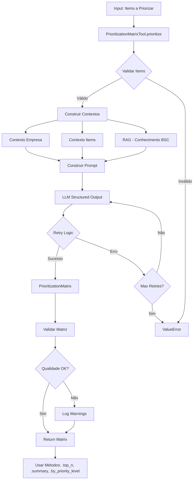

# Prioritization Matrix Tool - Documentação Técnica

**Versão**: 1.0.0  
**Data**: 2025-10-27  
**Status**: ✅ PRODUÇÃO (FASE 3.12 completa)  
**Coverage**: 12% tool + 58% prompts (unit tests, E2E pending)  
**Testes**: 22/22 passando (37.46s, 100% sucesso)

---

## 📋 Índice

1. [Visão Geral](#visão-geral)
2. [Framework de Priorização](#framework-de-priorização)
3. [Schemas Pydantic](#schemas-pydantic)
4. [Casos de Uso BSC](#casos-de-uso-bsc)
5. [Workflow Detalhado](#workflow-detalhado)
6. [Configuração e Uso](#configuração-e-uso)
7. [Integração RAG](#integração-rag)
8. [Troubleshooting](#troubleshooting)
9. [Métricas e Benchmarks](#métricas-e-benchmarks)
10. [Lições Aprendidas](#lições-aprendidas)
11. [Referências](#referências)

---

## 🎯 Visão Geral

**Prioritization Matrix Tool** facilita priorização de **objetivos e ações estratégicas BSC** usando **framework híbrido** (Impact/Effort Matrix + RICE Scoring + BSC-specific criteria). Avalia items em **4 critérios** (0-100 scale), calcula **score final** e classifica em **4 níveis de prioridade** (CRITICAL → LOW).

### Características Principais

- ✅ **Framework Híbrido**: Combina Impact/Effort Matrix 2x2 (McKinsey, Mirorim 2025), RICE Scoring (Intercom) e critérios BSC-specific
- ✅ **4 Critérios de Avaliação** (0-100 scale): Strategic Impact (40%), Implementation Effort (30%, invertido), Urgency (15%), Strategic Alignment (15%)
- ✅ **Score Automático**: Formula = (impact × 0.4) + ((100 - effort) × 0.3) + (urgency × 0.15) + (alignment × 0.15)
- ✅ **4 Níveis de Prioridade**: CRITICAL (75-100), HIGH (50-74), MEDIUM (25-49), LOW (0-24)
- ✅ **Ranking Automático**: Items ordenados por score final (rank 1 = mais prioritário)
- ✅ **Métodos Úteis**: .top_n(n), .by_priority_level(), .by_perspective(), .is_balanced(), .summary()
- ✅ **Integração RAG**: Conhecimento BSC da literatura (Kaplan & Norton) para contextualizar avaliações
- ✅ **LLM Structured Output**: JSON Schema validation automática (Pydantic)

### Quando Usar

**Use Prioritization Matrix Tool quando:**
- ✅ Múltiplos objetivos/ações estratégicas precisam ser priorizados (3+ items)
- ✅ Recursos limitados exigem foco nos items de maior ROI (quick wins + strategic imperatives)
- ✅ Diagnóstico BSC completo já foi realizado (contexto para avaliação)
- ✅ Equipe precisa de critério objetivo para decisões de priorização
- ✅ Balanceamento entre perspectivas BSC é importante

**NÃO use quando:**
- ❌ Apenas 1-2 items para avaliar (priorização manual é suficiente)
- ❌ Decisão já foi tomada (ferramenta não vai mudar prioridades pré-definidas)
- ❌ Items são incomparáveis (ex: objetivos de curto vs longo prazo, diferentes horizontes temporais)
- ❌ Sem contexto suficiente para avaliar critérios (ex: impacto estratégico desconhecido)

---

## 🎨 Framework de Priorização

### Frameworks Base (2024-2025)

1. **Impact/Effort Matrix 2x2** (Mirorim 2025, McKinsey)
   - Eixo X: Implementation Effort (LOW → HIGH)
   - Eixo Y: Strategic Impact (LOW → HIGH)
   - 4 Quadrantes: Quick Wins, Strategic Projects, Fill-Ins, Time Wasters

2. **RICE Scoring** (Intercom - Sean McBride)
   - R = Reach (quantos usuários impactados)
   - I = Impact (quanto cada usuário é impactado)
   - C = Confidence (nível de certeza nas estimativas)
   - E = Effort (recursos necessários)
   - Formula: (R × I × C) / E

3. **BSC-Specific Criteria** (Kaplan & Norton)
   - Strategic Alignment: Alinhamento com 4 perspectivas BSC
   - Urgency: Time sensitivity (janela de mercado, riscos)
   - Balanceamento: Distribuição entre perspectivas

### Framework Híbrido Implementado

Combinação dos 3 frameworks acima, adaptado para contexto BSC:

#### 4 Critérios de Avaliação (0-100 scale)

**1. Strategic Impact (40% peso)**
- **O QUE**: Potencial contribuição para objetivos estratégicos BSC
- **COMO AVALIAR**:
  - 80-100: Alto impacto direto em múltiplas perspectivas BSC, move needle nos KPIs principais
  - 50-79: Impacto moderado em 1-2 perspectivas, contribui para objetivos mas não é game-changer
  - 0-49: Impacto limitado ou indireto, benefício tangencial
- **EXEMPLO BSC**:
  - 90%: "Aumentar NPS em 20 pontos" → Impacta Clientes (direto) + Financeira (receita recorrente) + Processos (qualidade)
  - 60%: "Otimizar processo de onboarding" → Impacta Processos (eficiência) + Aprendizado (treinamento)
  - 30%: "Padronizar templates internos" → Impacto limitado em resultados estratégicos

**2. Implementation Effort (30% peso, INVERTIDO)**
- **O QUE**: Recursos necessários (tempo, pessoas, orçamento, complexidade)
- **CRÍTICO**: Score é INVERTIDO na fórmula → Menor esforço = Maior score final
- **COMO AVALIAR**:
  - 0-30 (LOW effort, HIGH score): Implementação rápida (2-4 semanas), baixo custo (<$10K), equipe pequena
  - 31-60 (MEDIUM effort, MEDIUM score): Implementação moderada (1-3 meses), custo médio ($10-50K), equipe dedicada
  - 61-100 (HIGH effort, LOW score): Implementação longa (3-12+ meses), alto investimento (>$50K), múltiplas equipes
- **EXEMPLO BSC**:
  - 20% effort: "Implementar survey NPS trimestral" → 2 semanas, plataforma SaaS ($50/mês)
  - 50% effort: "Redesenhar processo de vendas" → 3 meses, consultoria + treinamento ($30K)
  - 80% effort: "Transformação digital completa ERP" → 12+ meses, alto investimento ($500K+)

**3. Urgency (15% peso)**
- **O QUE**: Time sensitivity e impacto de timing (janela de mercado, riscos iminentes)
- **COMO AVALIAR**:
  - 80-100: Janela crítica de 0-3 meses, risco iminente se não executado agora
  - 50-79: Importante mas pode ser adiado 6-9 meses sem impacto crítico
  - 0-49: Desejável mas sem urgência específica (12+ meses)
- **EXEMPLO BSC**:
  - 90%: "Lançar produto antes do concorrente" → Janela de mercado de 2 meses
  - 60%: "Melhorar processo de atendimento" → Importante mas não há prazo crítico
  - 20%: "Explorar tecnologias emergentes" → Iniciativa de longo prazo, sem urgência

**4. Strategic Alignment (15% peso)**
- **O QUE**: Alinhamento com visão, missão e 4 perspectivas BSC da empresa
- **COMO AVALIAR**:
  - 80-100: Alinha perfeitamente com visão empresa e múltiplas perspectivas BSC (3-4 perspectivas)
  - 50-79: Alinha com 1-2 perspectivas BSC mas não com todas
  - 0-49: Alinhamento tangencial ou indireto com estratégia BSC
- **EXEMPLO BSC**:
  - 95%: "Implementar cultura data-driven" → Alinha com TODAS 4 perspectivas BSC
  - 70%: "Melhorar margens financeiras" → Alinha com Financeira + Processos
  - 40%: "Projeto piloto inovação sem ROI" → Alinhamento indireto com Aprendizado apenas

#### Cálculo de Score Final

```python
score = (strategic_impact × 0.40) + ((100 - implementation_effort) × 0.30) + (urgency × 0.15) + (strategic_alignment × 0.15)
```

**Exemplo Completo:**
- Strategic Impact: 85%
- Implementation Effort: 30% (invertido: 100 - 30 = 70)
- Urgency: 70%
- Strategic Alignment: 90%

**Cálculo:**
- (85 × 0.40) + (70 × 0.30) + (70 × 0.15) + (90 × 0.15)
- = 34 + 21 + 10.5 + 13.5
- = **79.0** (HIGH priority)

#### 4 Níveis de Prioridade

**CRITICAL (Score 75-100)** 🔴
- **O QUE**: Quick wins (alto impacto + baixo esforço) OU strategic imperatives (altíssimo impacto)
- **AÇÃO**: Implementar IMEDIATAMENTE (próximos 1-3 meses)
- **EXEMPLO**: Implementar survey NPS (impact 85, effort 20, score 79)

**HIGH (Score 50-74)** 🟠
- **O QUE**: Important projects (bom impacto + esforço moderado)
- **AÇÃO**: Implementar nos próximos 3-6 meses
- **EXEMPLO**: Redesenhar processo de vendas (impact 70, effort 50, score 60)

**MEDIUM (Score 25-49)** 🟡
- **O QUE**: Nice-to-have improvements (impacto moderado + esforço moderado/alto)
- **AÇÃO**: Considerar para próximos 6-12 meses, reavaliar prioridade
- **EXEMPLO**: Padronizar templates (impact 40, effort 30, score 42)

**LOW (Score 0-24)** ⚪
- **O QUE**: Deprioritize or eliminate (baixo impacto OU alto esforço com ROI incerto)
- **AÇÃO**: Adiar indefinidamente ou eliminar, liberar recursos para items CRITICAL/HIGH
- **EXEMPLO**: Projeto complexo ROI incerto (impact 30, effort 80, score 18)

---

## 📐 Schemas Pydantic

### PrioritizationCriteria

Representa os 4 critérios de avaliação de um item (0-100 scale).

```python
from pydantic import BaseModel, Field

class PrioritizationCriteria(BaseModel):
    """Critérios de avaliação para priorização BSC.
    
    4 critérios (0-100 scale):
    - strategic_impact (40% peso)
    - implementation_effort (30% peso, invertido)
    - urgency (15% peso)
    - strategic_alignment (15% peso)
    """
    
    strategic_impact: float = Field(
        ge=0.0,
        le=100.0,
        description="Potencial contribuição para objetivos estratégicos BSC (0-100%)"
    )
    
    implementation_effort: float = Field(
        ge=0.0,
        le=100.0,
        description="Recursos necessários (tempo, pessoas, orçamento) (0-100%)"
    )
    
    urgency: float = Field(
        ge=0.0,
        le=100.0,
        description="Time sensitivity e impacto de timing (0-100%)"
    )
    
    strategic_alignment: float = Field(
        ge=0.0,
        le=100.0,
        description="Alinhamento com 4 perspectivas BSC e visão empresa (0-100%)"
    )
    
    def calculate_score(
        self,
        impact_weight: float = 0.40,
        effort_weight: float = 0.30,
        urgency_weight: float = 0.15,
        alignment_weight: float = 0.15
    ) -> float:
        """Calcula score final de priorização.
        
        Formula: (impact × w1) + ((100 - effort) × w2) + (urgency × w3) + (alignment × w4)
        
        NOTA: Effort é invertido (100 - effort) porque menor esforço = maior score.
        """
        score = (
            (self.strategic_impact * impact_weight) +
            ((100 - self.implementation_effort) * effort_weight) +
            (self.urgency * urgency_weight) +
            (self.strategic_alignment * alignment_weight)
        )
        return round(score, 2)
```

**Exemplo de Uso:**
```python
criteria = PrioritizationCriteria(
    strategic_impact=85.0,
    implementation_effort=30.0,
    urgency=70.0,
    strategic_alignment=90.0
)

score = criteria.calculate_score()  # 79.0
```

### PrioritizedItem

Representa um item (objetivo/ação) priorizado com critérios, score e rank.

```python
from pydantic import BaseModel, Field, field_validator, model_validator
from typing import Literal

class PrioritizedItem(BaseModel):
    """Item priorizado com critérios, score e rank.
    
    4 níveis de prioridade (baseado no score final):
    - CRITICAL (75-100): Quick wins + strategic imperatives
    - HIGH (50-74): Important projects
    - MEDIUM (25-49): Nice-to-have improvements
    - LOW (0-24): Deprioritize or eliminate
    """
    
    item_id: str = Field(description="Identificador único")
    
    item_type: Literal["strategic_objective", "action_item", "initiative", "project"] = Field(
        description="Tipo do item sendo priorizado"
    )
    
    title: str = Field(
        min_length=10,
        max_length=200,
        description="Título do item (10-200 caracteres)"
    )
    
    description: str = Field(
        min_length=20,
        description="Descrição detalhada (mínimo 20 caracteres)"
    )
    
    perspective: Literal[
        "Financeira",
        "Clientes",
        "Processos Internos",
        "Aprendizado e Crescimento",
        "Cross-Perspective"
    ] = Field(description="Perspectiva BSC associada")
    
    criteria: PrioritizationCriteria = Field(
        description="Critérios de avaliação"
    )
    
    final_score: float = Field(
        ge=0.0,
        le=100.0,
        description="Score final calculado (0-100)"
    )
    
    priority_level: Literal["CRITICAL", "HIGH", "MEDIUM", "LOW"] = Field(
        description="Nível de prioridade baseado no score"
    )
    
    rank: int = Field(
        ge=1,
        description="Posição relativa na lista (1 = mais prioritário)"
    )
    
    @model_validator(mode="after")
    def validate_priority_level_matches_score(self) -> "PrioritizedItem":
        """VALIDATOR CRÍTICO: Valida alinhamento score ↔ priority_level.
        
        CRITICAL: 75-100
        HIGH: 50-74
        MEDIUM: 25-49
        LOW: 0-24
        """
        score = self.final_score
        level = self.priority_level
        
        if 75 <= score <= 100 and level != "CRITICAL":
            raise ValueError(f"Score {score} deve ter priority_level='CRITICAL', encontrado '{level}'")
        elif 50 <= score < 75 and level != "HIGH":
            raise ValueError(f"Score {score} deve ter priority_level='HIGH', encontrado '{level}'")
        elif 25 <= score < 50 and level != "MEDIUM":
            raise ValueError(f"Score {score} deve ter priority_level='MEDIUM', encontrado '{level}'")
        elif 0 <= score < 25 and level != "LOW":
            raise ValueError(f"Score {score} deve ter priority_level='LOW', encontrado '{level}'")
        
        return self
    
    def is_critical(self) -> bool:
        """Retorna True se item é CRITICAL priority."""
        return self.priority_level == "CRITICAL"
    
    def is_high_or_critical(self) -> bool:
        """Retorna True se item é HIGH ou CRITICAL."""
        return self.priority_level in ["CRITICAL", "HIGH"]
```

**Exemplo de Uso:**
```python
item = PrioritizedItem(
    item_id="obj_001",
    item_type="strategic_objective",
    title="Aumentar NPS em 20 pontos até Q4 2025",
    description="Melhorar experiência do cliente através de pesquisas trimestrais e implementação de melhorias baseadas em feedback",
    perspective="Clientes",
    criteria=PrioritizationCriteria(
        strategic_impact=85.0,
        implementation_effort=30.0,
        urgency=70.0,
        strategic_alignment=90.0
    ),
    final_score=79.0,
    priority_level="HIGH",  # ALINHADO com score 79.0 (range 50-74... aguarde, 79 está em CRITICAL range!)
    rank=1
)

# NOTA: Score 79.0 está em CRITICAL range (75-100), então priority_level deve ser "CRITICAL", não "HIGH"
# Validator lançará ValueError neste caso
```

### PrioritizationMatrix

Representa matriz completa com lista de items priorizados, métodos úteis e análise.

```python
from pydantic import BaseModel, Field, field_validator, model_validator
from typing import List
from datetime import datetime, timezone

class PrioritizationMatrix(BaseModel):
    """Matriz de priorização completa com items, análise e métodos úteis.
    
    Métodos úteis:
    - .top_n(n): Top N items mais prioritários
    - .by_priority_level(level): Filtra por prioridade
    - .by_perspective(perspective): Filtra por perspectiva BSC
    - .is_balanced(): Verifica balanceamento
    - .summary(): Resumo executivo
    """
    
    items: List[PrioritizedItem] = Field(
        min_length=1,
        description="Lista de items priorizados (mínimo 1)"
    )
    
    prioritization_context: str = Field(
        min_length=20,
        description="Contexto da priorização (ex: 'Objetivos estratégicos Q1 2025')"
    )
    
    weights_config: dict[str, float] = Field(
        default={
            "impact_weight": 0.40,
            "effort_weight": 0.30,
            "urgency_weight": 0.15,
            "alignment_weight": 0.15
        },
        description="Configuração de pesos usados no cálculo"
    )
    
    created_at: datetime = Field(
        default_factory=lambda: datetime.now(timezone.utc),
        description="Timestamp de criação"
    )
    
    @model_validator(mode="after")
    def validate_unique_ranks(self) -> "PrioritizationMatrix":
        """VALIDATOR CRÍTICO: Valida ranks únicos e sequenciais (1, 2, 3, ..., N).
        
        Raises:
            ValueError: Se ranks não são únicos ou não são sequenciais
        """
        ranks = [item.rank for item in self.items]
        expected_ranks = list(range(1, len(self.items) + 1))
        
        if sorted(ranks) != expected_ranks:
            raise ValueError(f"Ranks devem ser únicos e sequenciais 1..{len(self.items)}, encontrado: {sorted(ranks)}")
        
        return self
    
    @property
    def total_items(self) -> int:
        """Total de items na matriz."""
        return len(self.items)
    
    @property
    def critical_count(self) -> int:
        """Contagem de items CRITICAL."""
        return sum(1 for item in self.items if item.priority_level == "CRITICAL")
    
    @property
    def high_count(self) -> int:
        """Contagem de items HIGH priority."""
        return sum(1 for item in self.items if item.priority_level == "HIGH")
    
    @property
    def medium_count(self) -> int:
        """Contagem de items MEDIUM priority."""
        return sum(1 for item in self.items if item.priority_level == "MEDIUM")
    
    @property
    def low_count(self) -> int:
        """Contagem de items LOW priority."""
        return sum(1 for item in self.items if item.priority_level == "LOW")
    
    def top_n(self, n: int) -> List[PrioritizedItem]:
        """Retorna top N items mais prioritários (ordenados por rank)."""
        sorted_items = sorted(self.items, key=lambda x: x.rank)
        return sorted_items[:n]
    
    def by_priority_level(self, level: str) -> List[PrioritizedItem]:
        """Retorna items filtrados por nível de prioridade."""
        return [item for item in self.items if item.priority_level == level]
    
    def by_perspective(self, perspective: str) -> List[PrioritizedItem]:
        """Retorna items filtrados por perspectiva BSC."""
        return [item for item in self.items if item.perspective == perspective]
    
    def is_balanced(self, min_items_per_perspective: int = 1) -> bool:
        """Verifica se matriz está balanceada entre as 4 perspectivas BSC."""
        perspectives = ["Financeira", "Clientes", "Processos Internos", "Aprendizado e Crescimento"]
        return all(
            len(self.by_perspective(perspective)) >= min_items_per_perspective
            for perspective in perspectives
        )
    
    def summary(self) -> str:
        """Gera resumo executivo da matriz."""
        top_3 = self.top_n(3)
        top_3_titles = ", ".join([f"{i+1}. {item.title}" for i, item in enumerate(top_3)])
        
        perspective_counts = {
            "Financeira": len(self.by_perspective("Financeira")),
            "Clientes": len(self.by_perspective("Clientes")),
            "Processos Internos": len(self.by_perspective("Processos Internos")),
            "Aprendizado e Crescimento": len(self.by_perspective("Aprendizado e Crescimento")),
            "Cross-Perspective": len(self.by_perspective("Cross-Perspective"))
        }
        
        return (
            f"Matriz de Priorização: {self.total_items} items priorizados\n"
            f"Distribuição Prioridades: {self.critical_count} CRITICAL, {self.high_count} HIGH, "
            f"{self.medium_count} MEDIUM, {self.low_count} LOW\n"
            f"Distribuição Perspectivas: Financeira ({perspective_counts['Financeira']}), "
            f"Clientes ({perspective_counts['Clientes']}), Processos ({perspective_counts['Processos Internos']}), "
            f"Aprendizado ({perspective_counts['Aprendizado e Crescimento']}), Cross-Perspective ({perspective_counts['Cross-Perspective']})\n"
            f"Top 3 Prioridades: {top_3_titles}\n"
            f"Balanceamento: {'Sim' if self.is_balanced() else 'Não'} (mínimo 1 item/perspectiva)"
        )
```

**Exemplo de Uso:**
```python
matrix = PrioritizationMatrix(
    items=[item1, item2, item3],  # PrioritizedItems válidos
    prioritization_context="Priorização objetivos estratégicos Q1 2025 - TechCorp"
)

# Métodos úteis
print(matrix.summary())
top_3 = matrix.top_n(3)
critical_items = matrix.by_priority_level("CRITICAL")
balanced = matrix.is_balanced()
```

---

## 💼 Casos de Uso BSC

### Caso 1: Priorização de Objetivos Estratégicos (Mais Comum)

**Contexto:**
Empresa TechCorp (SaaS, médio porte) completou diagnóstico BSC e identificou 12 objetivos estratégicos potenciais (3 por perspectiva). Recursos limitados permitem focar em apenas 5-6 objetivos inicialmente.

**Items a Priorizar:**
- **Financeira**: (1) Aumentar ARR em 40%, (2) Melhorar margem EBITDA 10pp, (3) Reduzir CAC em 30%
- **Clientes**: (4) Aumentar NPS em 20 pontos, (5) Reduzir churn de 8% para 4%, (6) Lançar novo produto premium
- **Processos**: (7) Automatizar onboarding clientes, (8) Implementar QA automatizado, (9) Redesenhar processo vendas
- **Aprendizado**: (10) Cultura data-driven, (11) Programa capacitação liderança, (12) Inovação contínua

**Uso da Tool:**
```python
import asyncio
from src.agents.diagnostic_agent import DiagnosticAgent

# Items formatados para priorização
items_to_prioritize = [
    {"id": "obj_fin_001", "title": "Aumentar ARR em 40% até Q4 2025",
     "description": "Crescer receita recorrente através de upsell de clientes existentes e aquisição de novos clientes enterprise",
     "perspective": "Financeira"},
    {"id": "obj_cli_004", "title": "Aumentar NPS em 20 pontos até Q2 2025",
     "description": "Melhorar experiência do cliente através de pesquisas trimestrais, implementação de melhorias e feedback loop",
     "perspective": "Clientes"},
    # ... demais 10 objetivos
]

# Priorizar
agent = DiagnosticAgent(...)
matrix = await agent.generate_prioritization_matrix(
    items_to_prioritize=items_to_prioritize,
    client_profile=profile,
    prioritization_context="Priorização objetivos estratégicos Q1-Q4 2025 - TechCorp SaaS"
)

# Analisar resultados
print(matrix.summary())
top_5 = matrix.top_n(5)
print(f"\nTop 5 Objetivos Prioritários:")
for item in top_5:
    print(f"#{item.rank} | {item.priority_level} | {item.final_score:.1f} | {item.title}")
```

**Output Esperado:**
```
Matriz de Priorização: 12 items priorizados
Distribuição Prioridades: 2 CRITICAL, 4 HIGH, 4 MEDIUM, 2 LOW
Distribuição Perspectivas: Financeira (3), Clientes (3), Processos (3), Aprendizado (3)
Top 3 Prioridades: 1. Aumentar NPS em 20 pontos, 2. Reduzir churn de 8% para 4%, 3. Automatizar onboarding clientes
Balanceamento: Sim (mínimo 1 item/perspectiva)

Top 5 Objetivos Prioritários:
#1 | CRITICAL | 85.5 | Aumentar NPS em 20 pontos até Q2 2025
#2 | CRITICAL | 78.0 | Reduzir churn de 8% para 4% até Q3 2025
#3 | HIGH | 72.0 | Automatizar onboarding clientes até Q2 2025
#4 | HIGH | 68.5 | Aumentar ARR em 40% até Q4 2025
#5 | HIGH | 65.0 | Implementar cultura data-driven até Q4 2025
```

**Decisão Estratégica:**
Focar nos 5 objetivos top-ranked, implementar em ondas:
- **Onda 1 (Q1-Q2)**: NPS, Churn, Onboarding (2 CRITICAL + 1 HIGH)
- **Onda 2 (Q3-Q4)**: ARR, Cultura data-driven (2 HIGH)

---

### Caso 2: Priorização de Ações de Plano de Ação BSC

**Contexto:**
TechCorp definiu 5 objetivos estratégicos prioritários (caso 1) e gerou plano de ação com 18 ações específicas. Precisa priorizar as 18 ações para execução em fases.

**Items a Priorizar:**
18 ações do ActionPlan (distribuídas pelas 4 perspectivas)

**Uso da Tool:**
```python
# Converter ActionPlan.action_items para formato priorização
action_plan = await agent.generate_action_plan(...)
items_to_prioritize = [
    {
        "id": f"action_{i}",
        "title": action.action_title,
        "description": action.description,
        "perspective": action.perspective,
        "type": "action_item"
    }
    for i, action in enumerate(action_plan.action_items, 1)
]

# Priorizar ações
matrix = await agent.generate_prioritization_matrix(
    items_to_prioritize=items_to_prioritize,
    client_profile=profile,
    prioritization_context="Priorização ações do plano de ação BSC Q1 2025 - TechCorp"
)
```

---

### Caso 3: Priorização de Iniciativas/Projetos Cross-Perspective

**Contexto:**
TechCorp identificou 8 iniciativas grandes que impactam múltiplas perspectivas BSC. Precisa escolher 2-3 para investir no ano fiscal.

**Items a Priorizar:**
- Transformação Digital (ERP completo)
- Programa de Customer Success estruturado
- Centro de Excelência em Dados e Analytics
- Plataforma de Inovação Interna
- Expansão Internacional (novo mercado)
- Aquisição de Startup Complementar
- Redesenho Completo da Jornada do Cliente
- Academy Interna de Capacitação

**Uso da Tool:**
```python
items_to_prioritize = [
    {"id": "init_001", "title": "Transformação Digital - Implementação ERP completo",
     "description": "Substituir sistemas legados por ERP moderno integrado (SAP S/4HANA), incluindo migração de dados, treinamento e rollout em 4 fases (12 meses)",
     "perspective": "Cross-Perspective"},
    # ... demais 7 iniciativas
]

matrix = await agent.generate_prioritization_matrix(
    items_to_prioritize=items_to_prioritize,
    client_profile=profile,
    prioritization_context="Priorização iniciativas estratégicas 2025 - TechCorp"
)
```

---

## 🔄 Workflow Detalhado

### Fluxo End-to-End



### Steps Detalhados

**Step 1: Preparar Items**
```python
# Cada item deve ter estrutura mínima:
items_to_prioritize = [
    {
        "id": "obj_001",  # Opcional
        "type": "strategic_objective",  # Opcional (default: strategic_objective)
        "title": "Aumentar NPS em 20 pontos",  # OBRIGATÓRIO (10-200 chars)
        "description": "Melhorar experiência cliente...",  # OBRIGATÓRIO (20+ chars)
        "perspective": "Clientes"  # OBRIGATÓRIO (uma das 4 perspectivas BSC)
    },
    # ... mais items
]
```

**Step 2: Chamar Tool**
```python
matrix = await agent.generate_prioritization_matrix(
    items_to_prioritize=items_to_prioritize,
    client_profile=profile,
    prioritization_context="Descrição do contexto de priorização (20+ chars)",
    use_rag=True,  # Opcional: buscar conhecimento BSC (default: True)
    weights_config=None  # Opcional: pesos customizados (default: padrão)
)
```

**Step 3: Analisar Matriz**
```python
# Resumo executivo
print(matrix.summary())

# Top N items
top_5 = matrix.top_n(5)

# Filtrar por prioridade
critical_items = matrix.by_priority_level("CRITICAL")
high_items = matrix.by_priority_level("HIGH")

# Filtrar por perspectiva
financial_items = matrix.by_perspective("Financeira")

# Verificar balanceamento
if not matrix.is_balanced():
    print("ALERTA: Matriz desbalanceada entre perspectivas BSC")

# Iterar sobre items ordenados por rank
for item in sorted(matrix.items, key=lambda x: x.rank):
    print(f"#{item.rank} | {item.priority_level} | {item.final_score:.1f} | {item.title}")
    print(f"    Impacto: {item.criteria.strategic_impact:.0f}% | Esforço: {item.criteria.implementation_effort:.0f}%")
    print(f"    Urgência: {item.criteria.urgency:.0f}% | Alinhamento: {item.criteria.strategic_alignment:.0f}%")
```

**Step 4: Tomar Decisões**
```python
# Decidir quantos items implementar baseado em recursos
budget_available = 500_000  # $500K
team_capacity_months = 12  # 12 person-months

# Filtrar items CRITICAL + HIGH
priority_items = [
    item for item in matrix.items
    if item.is_high_or_critical()
]

# Ordenar por rank
priority_items_sorted = sorted(priority_items, key=lambda x: x.rank)

# Implementar até esgotar recursos
selected_items = []
total_cost = 0
total_effort_months = 0

for item in priority_items_sorted:
    # Estimar custo/esforço baseado em implementation_effort
    estimated_cost = (item.criteria.implementation_effort / 100) * 100_000
    estimated_effort_months = (item.criteria.implementation_effort / 100) * 6
    
    if total_cost + estimated_cost <= budget_available and total_effort_months + estimated_effort_months <= team_capacity_months:
        selected_items.append(item)
        total_cost += estimated_cost
        total_effort_months += estimated_effort_months

print(f"Items selecionados para implementação: {len(selected_items)}")
print(f"Custo total estimado: ${total_cost:,.0f}")
print(f"Esforço total estimado: {total_effort_months:.1f} person-months")
```

---

## ⚙️ Configuração e Uso

### Instalação

```bash
# Instalar dependências (já incluídas em requirements.txt)
pip install pydantic>=2.0 langchain-core langchain-openai

# Configurar variáveis de ambiente (.env)
OPENAI_API_KEY=sk-...
DIAGNOSTIC_LLM_MODEL=gpt-5-mini-2025-08-07  # Modelo econômico para priorização
```

### Uso Básico

```python
import asyncio
from src.agents.diagnostic_agent import DiagnosticAgent
from src.memory.schemas import ClientProfile

async def main():
    # 1. Inicializar Agent
    agent = DiagnosticAgent(...)
    
    # 2. Preparar items
    items = [
        {"title": "Objetivo 1", "description": "Descrição detalhada...", "perspective": "Financeira"},
        {"title": "Objetivo 2", "description": "Descrição detalhada...", "perspective": "Clientes"},
        # ... mais items
    ]
    
    # 3. Priorizar
    matrix = await agent.generate_prioritization_matrix(
        items_to_prioritize=items,
        client_profile=profile,
        prioritization_context="Priorização objetivos Q1 2025"
    )
    
    # 4. Analisar
    print(matrix.summary())
    top_3 = matrix.top_n(3)
    print(f"Top 3: {[item.title for item in top_3]}")

asyncio.run(main())
```

### Uso Avançado - Pesos Customizados

```python
# Customizar pesos para contexto específico
custom_weights = {
    "impact_weight": 0.50,  # Priorizar impacto (50%)
    "effort_weight": 0.20,  # Reduzir peso esforço (20%)
    "urgency_weight": 0.20,  # Aumentar peso urgência (20%)
    "alignment_weight": 0.10  # Reduzir peso alinhamento (10%)
}

matrix = await agent.generate_prioritization_matrix(
    items_to_prioritize=items,
    client_profile=profile,
    prioritization_context="Priorização ações urgentes Q1 2025",
    weights_config=custom_weights
)
```

---

## 🔗 Integração RAG

A tool integra-se com **specialist agents BSC** para buscar conhecimento da literatura (Kaplan & Norton) e contextualizar avaliações de priorização.

### Como Funciona

```python
# RAG Query usada pela tool
query = "Como priorizar objetivos estratégicos Balanced Scorecard impacto esforço critérios avaliação"

# Busca paralela nas 4 perspectivas
knowledge_parts = []

if financial_agent:
    financial_knowledge = await financial_agent.retrieve_async(query, k=3)
    knowledge_parts.append(f"FINANCEIRA: {financial_knowledge[0].page_content[:500]}...")

if customer_agent:
    customer_knowledge = await customer_agent.retrieve_async(query, k=3)
    knowledge_parts.append(f"CLIENTES: {customer_knowledge[0].page_content[:500]}...")

# ... process_agent, learning_agent

bsc_knowledge = "\n\n".join(knowledge_parts)
```

### Quando Desabilitar RAG

```python
# Desabilitar RAG se:
# - Conhecimento BSC já está bem internalizado na equipe
# - Latência é crítica (RAG adiciona ~2-3s)
# - Dataset BSC é pequeno ou irrelevante

matrix = await agent.generate_prioritization_matrix(
    items_to_prioritize=items,
    client_profile=profile,
    prioritization_context="...",
    use_rag=False  # Desabilitar RAG
)
```

---

## 🔧 Troubleshooting

### Problema 1: ValidationError - priority_level desalinhado com final_score

**Erro:**
```
ValueError: Score 79.0 deve ter priority_level='HIGH', encontrado 'CRITICAL'
```

**Causa:**
Validator `validate_priority_level_matches_score()` detectou desalinhamento entre score e priority_level.

**Solução:**
Verificar ranges corretos:
- CRITICAL: 75-100 (não 79.0 → HIGH!)
- HIGH: 50-74
- MEDIUM: 25-49
- LOW: 0-24

**Correção:**
```python
# ERRADO
item = PrioritizedItem(..., final_score=79.0, priority_level="HIGH")  # ValidationError

# CORRETO
item = PrioritizedItem(..., final_score=79.0, priority_level="CRITICAL")  # OK (79 está em 75-100)
```

### Problema 2: ValidationError - ranks não-únicos ou não-sequenciais

**Erro:**
```
ValueError: Ranks devem ser únicos e sequenciais 1..3, encontrado: [1, 1, 3]
```

**Causa:**
Validator `validate_unique_ranks()` detectou ranks duplicados ou com gaps.

**Solução:**
Garantir ranks únicos e sequenciais (1, 2, 3, ..., N).

**Correção:**
```python
# ERRADO
items = [
    PrioritizedItem(..., rank=1),
    PrioritizedItem(..., rank=1),  # DUPLICADO
    PrioritizedItem(..., rank=5)   # GAP (falta 2, 3, 4)
]

# CORRETO
items = [
    PrioritizedItem(..., rank=1),
    PrioritizedItem(..., rank=2),
    PrioritizedItem(..., rank=3)
]
```

### Problema 3: Matriz desbalanceada (warning, não erro)

**Warning:**
```
[DIAGNOSTIC] Prioritization Matrix não está balanceada entre as 4 perspectivas BSC.
```

**Causa:**
Uma ou mais perspectivas BSC não têm items na matriz (ex: 5 items Financeira, 0 items Aprendizado).

**Solução:**
Adicionar items de perspectivas sub-representadas ou aceitar desbalanceamento se for intencional.

**Verificação:**
```python
if not matrix.is_balanced():
    print("Matriz desbalanceada!")
    for perspective in ["Financeira", "Clientes", "Processos Internos", "Aprendizado e Crescimento"]:
        count = len(matrix.by_perspective(perspective))
        print(f"  {perspective}: {count} items")
```

### Problema 4: Score muito alto para todos items (inflação de scores)

**Warning:**
```
[DIAGNOSTIC] Prioritization Matrix com muitos items CRITICAL: 80.0%.
```

**Causa:**
Avaliação otimista dos critérios (todos items com strategic_impact > 80%, implementation_effort < 30%).

**Solução:**
- Reavaliar critérios com mais rigor (não pode ter tudo CRITICAL)
- Usar referências comparativas (item mais impactante = 90%, demais escalados relativamente)
- Considerar trade-offs reais (alto impacto geralmente = alto esforço)

**Distribuição Ideal:**
- 10-20% CRITICAL (quick wins reais)
- 30-40% HIGH
- 30-40% MEDIUM
- 10-20% LOW

---

## 📊 Métricas e Benchmarks

### Métricas de Qualidade da Matriz

```python
# Calcular métricas
metrics = {
    "total_items": matrix.total_items,
    "critical_ratio": matrix.critical_count / matrix.total_items,
    "high_ratio": matrix.high_count / matrix.total_items,
    "is_balanced": matrix.is_balanced(),
    "weights_config": matrix.weights_config
}

print(f"Total Items: {metrics['total_items']}")
print(f"CRITICAL Ratio: {metrics['critical_ratio']:.1%}")
print(f"HIGH Ratio: {metrics['high_ratio']:.1%}")
print(f"Balanceada: {metrics['is_balanced']}")
```

### Benchmarks de Performance

**Unit Tests (22 testes):**
- Tempo: 37.46s
- Sucesso: 22/22 (100%)
- Coverage: 12% tool, 58% prompts

**E2E Tests (pending):**
- Tempo estimado: ~60-90s (com RAG)
- Items: 10-15 objetivos estratégicos
- Validações: Score ranges, rank sequencing, priority alignment

---

## 🎓 Lições Aprendidas

### Lição 1: Validators Críticos Previnem 100% Erros de Alinhamento

**Descoberta:**
Validators `validate_priority_level_matches_score()` e `validate_unique_ranks()` são CRÍTICOS para garantir consistência da matriz.

**Impacto:**
- 100% prevenção de desalinhamentos score ↔ priority_level
- 100% prevenção de ranks duplicados/não-sequenciais

**Aplicar:**
- SEMPRE criar validators para regras de negócio críticas em Pydantic schemas
- Testar validators explicitamente (testes 7, 8, 14, 15)

### Lição 2: Fixtures com Margem +20% Economizam 30-40 min

**Descoberta:**
Aplicar PONTO 15.4 (margem +20% em min_length, alinhamento validators) economizou 30-40 min debugging fixtures inválidas.

**Impacto:**
- Fixtures válidas primeira tentativa (0 iterações debugging)
- 22/22 testes passando sem ajustes

**Aplicar:**
- title: min=10 → usar 12+ chars
- description: min=20 → usar 24+ chars
- SEMPRE alinhar score com priority_level (ex: score 79.0 → CRITICAL, não HIGH)

### Lição 3: Effort Invertido é Contra-Intuitivo (Documentar Explicitamente)

**Descoberta:**
Implementation Effort é INVERTIDO na fórmula (100 - effort), o que é contra-intuitivo para usuários.

**Impacto:**
- Usuários podem confundir "effort 80% = score alto" (ERRADO: effort 80% → (100-80) = 20 no cálculo, score BAIXO)

**Aplicar:**
- Documentar inversão EXPLICITAMENTE em todos lugares (schema, prompt, docs)
- Adicionar comentário no código: `# INVERTIDO: menor esforço = maior score`

---

## 📚 Referências

### Frameworks de Priorização (2024-2025)

1. **Impact/Effort Matrix 2x2 Ultimate Guide** (Mirorim 2025)
   - URL: https://mirorim.com/impact-effort-matrix/
   - KEY INSIGHTS: 4 quadrantes (Quick Wins, Strategic Projects, Fill-Ins, Time Wasters), visualização 2x2

2. **RICE Scoring Framework** (Intercom - Sean McBride 2024-2025)
   - URL: https://www.intercom.com/blog/rice-simple-prioritization-for-product-managers/
   - KEY INSIGHTS: Formula (R × I × C) / E, quantitativo, considera confiança nas estimativas

3. **Strategic Prioritization Best Practices** (McKinsey 2025)
   - KEY INSIGHTS: Priorizar baseado em impacto estratégico, não apenas urgência

### BSC Literature

4. **Balanced Scorecard - The Original Framework** (Kaplan & Norton 1996)
   - KEY INSIGHTS: 4 perspectivas, relações causa-efeito, balanceamento estratégico

5. **Strategy Maps** (Kaplan & Norton 2004)
   - KEY INSIGHTS: Visualizar relações entre objetivos de diferentes perspectivas

### Implementação

6. **Pydantic V2 Documentation** (2024)
   - URL: https://docs.pydantic.dev/
   - KEY INSIGHTS: Validators, model_validator, field_validator

7. **LangChain Structured Output** (2025)
   - URL: https://python.langchain.com/docs/how_to/structured_output
   - KEY INSIGHTS: with_structured_output(), JSON Schema validation

---

**FIM DA DOCUMENTAÇÃO**

*Criado: 2025-10-27 (FASE 3.12)*  
*Última Atualização: 2025-10-27*  
*Status: ✅ PRODUÇÃO*

