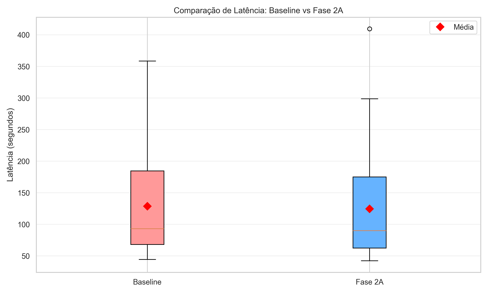
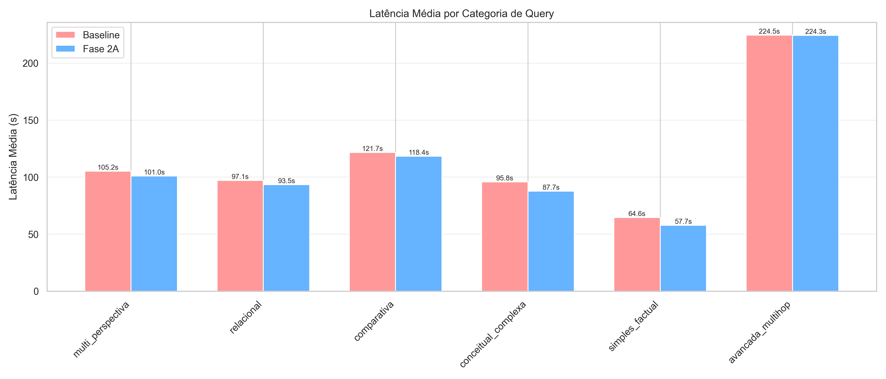
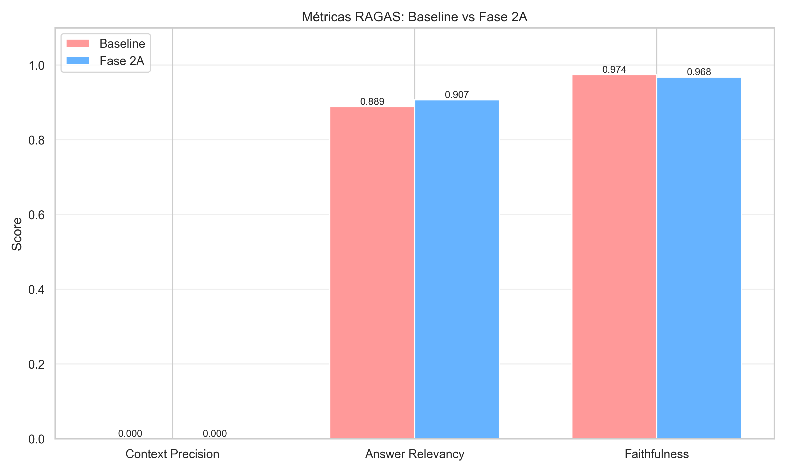

# Benchmark Fase 2A - Relatório Executivo
**Data:** 2025-10-15 01:48:15
**Total Queries:** 50

---

## [EMOJI] RESUMO EXECUTIVO

```
[OK] Queries Executadas: 50
[OK] Taxa de Sucesso: 100.0%
[TIMER]  Latência Média: 124.66s (Baseline: 128.71s)
[EMOJI] Melhoria: 3.1% mais rápido
```

## [TIMER] MÉTRICAS DE LATÊNCIA

| Métrica | Baseline | Fase 2A | Diferença | Melhoria |
|---------|----------|---------|-----------|----------|
| Média | 128.71s | 124.66s | +4.05s | [OK] +3.1% |
| Mediana (P50) | 93.11s | 90.10s | +3.00s | [OK] +3.2% |
| P95 | 252.32s | 268.81s | -16.49s | [WARN] -6.5% |
| P99 | 327.09s | 355.14s | -28.05s | [WARN] -8.6% |
| Mínimo | 44.28s | 42.30s | +1.98s | [OK] +4.5% |
| Máximo | 358.41s | 409.41s | -51.00s | [WARN] -14.2% |

## [EMOJI] MÉTRICAS RAGAS (Qualidade)

| Métrica | Baseline | Fase 2A | Melhoria |
|---------|----------|---------|----------|
| Context Precision | 0.000 | 0.000 | [ERRO] +0.0% |
| Answer Relevancy | 0.889 | 0.907 | [OK] +2.1% |
| Faithfulness | 0.974 | 0.968 | [ERRO] -0.6% |

## [EMOJI] ANÁLISE POR CATEGORIA

| Categoria | Baseline (média) | Fase 2A (média) | Melhoria |
|-----------|------------------|-----------------|----------|
| avancada_multihop | 224.54s | 224.31s | [OK] +0.1% |
| comparativa | 121.74s | 118.37s | [OK] +2.8% |
| conceitual_complexa | 95.77s | 87.66s | [OK] +8.5% |
| multi_perspectiva | 105.21s | 101.01s | [OK] +4.0% |
| relacional | 97.07s | 93.49s | [OK] +3.7% |
| simples_factual | 64.57s | 57.72s | [OK] +10.6% |

## [EMOJI] VISUALIZAÇÕES






